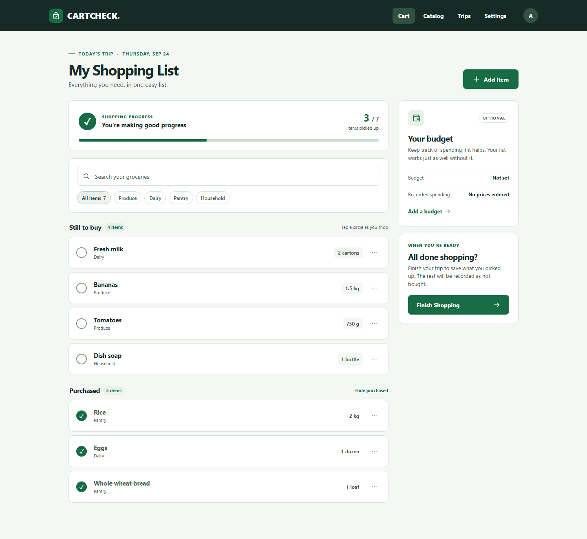
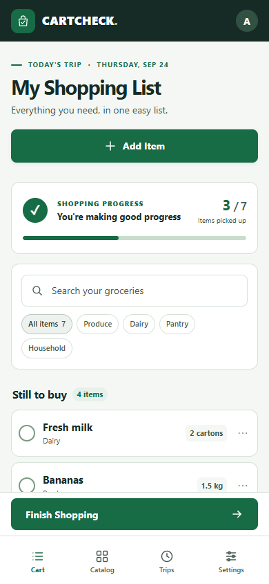

# Mockup

Your prelim wireframes are finished and are not being redone. The mockup is what
the app will actually look like: the wireframes painted in, with your real
colours, type, spacing and content.

**This is submitted as images or a PDF.** A written description of a picture
scores in the lowest band, because the thing being asked for is the picture.

Put the exported images in `assets/` and link them here, so the repository
carries them too.

## Final CartCheck visual mockups

These PNGs are exports of the [approved static prototypes](design/prototype/README.md). They show the complete CartCheck screen set with the established light background, dark header, white cards, and green actions. Phone views with more content have numbered continuation captures; these are successive views of the same screen with its fixed navigation visible.

| Screen or state | Desktop PNG | Phone portrait PNG |
| --- | --- | --- |
| Active shopping list | [Desktop](assets/mockups/01-shopping-list-desktop.png) | [Top](assets/mockups/01-shopping-list-mobile-01.png) · [Middle](assets/mockups/01-shopping-list-mobile-02.png) · [Bottom](assets/mockups/01-shopping-list-mobile-03.png) · [Landscape top](assets/mockups/01-shopping-list-landscape-01.png) · [Landscape continued](assets/mockups/01-shopping-list-landscape-02.png) |
| Empty shopping list | [Desktop](assets/mockups/02-empty-list-desktop.png) | [Phone](assets/mockups/02-empty-list-mobile-01.png) |
| Add grocery item | [Desktop](assets/mockups/03-add-item-desktop.png) | [Top](assets/mockups/03-add-item-mobile-01.png) · [Continued](assets/mockups/03-add-item-mobile-02.png) |
| Edit grocery item | [Desktop](assets/mockups/04-edit-item-desktop.png) | [Top](assets/mockups/04-edit-item-mobile-01.png) · [Continued](assets/mockups/04-edit-item-mobile-02.png) |
| Grocery catalog and no-results example | [Desktop](assets/mockups/05-catalog-desktop.png) | [Top](assets/mockups/05-catalog-mobile-01.png) · [Middle](assets/mockups/05-catalog-mobile-02.png) · [Bottom](assets/mockups/05-catalog-mobile-03.png) |
| Register custom grocery | [Desktop](assets/mockups/06-register-custom-grocery-desktop.png) | [Phone](assets/mockups/06-register-custom-grocery-mobile-01.png) |
| Edit catalog item | [Desktop](assets/mockups/07-edit-catalog-item-desktop.png) | [Phone](assets/mockups/07-edit-catalog-item-mobile-01.png) |
| Finish Shopping review and confirmation | [Desktop](assets/mockups/08-finish-shopping-review-desktop.png) | [Top](assets/mockups/08-finish-shopping-review-mobile-01.png) · [Continued](assets/mockups/08-finish-shopping-review-mobile-02.png) |
| Trip saved state | [Desktop](assets/mockups/09-trip-saved-desktop.png) | [Phone](assets/mockups/09-trip-saved-mobile-01.png) |
| Shopping history | [Desktop](assets/mockups/10-trip-history-desktop.png) | [Phone](assets/mockups/10-trip-history-mobile-01.png) |
| Trip details: current example | [Desktop](assets/mockups/11-trip-details-current-desktop.png) | [Top](assets/mockups/11-trip-details-current-mobile-01.png) · [Continued](assets/mockups/11-trip-details-current-mobile-02.png) |
| Trip details: previous example | [Desktop](assets/mockups/12-trip-details-previous-desktop.png) | [Top](assets/mockups/12-trip-details-previous-mobile-01.png) · [Continued](assets/mockups/12-trip-details-previous-mobile-02.png) |
| Correct historical trip | [Desktop](assets/mockups/13-correct-trip-desktop.png) | [Top](assets/mockups/13-correct-trip-mobile-01.png) · [Continued](assets/mockups/13-correct-trip-mobile-02.png) |
| Confirm historical correction | [Desktop](assets/mockups/14-confirm-trip-correction-desktop.png) | [Phone](assets/mockups/14-confirm-trip-correction-mobile-01.png) |
| Correction saved state | [Desktop](assets/mockups/15-trip-correction-saved-desktop.png) | [Phone](assets/mockups/15-trip-correction-saved-mobile-01.png) |
| Sign in | [Desktop](assets/mockups/16-sign-in-desktop.png) | [Phone](assets/mockups/16-sign-in-mobile-01.png) |
| Register account | [Desktop](assets/mockups/17-register-account-desktop.png) | [Phone](assets/mockups/17-register-account-mobile-01.png) |
| Settings | [Desktop](assets/mockups/18-settings-desktop.png) | [Phone](assets/mockups/18-settings-mobile-01.png) |

## What it should show

- Every screen in your revised proposal, and no screens that are not in it
- Real content, not "Lorem ipsum" and not "Title here"
- The empty state of at least one screen, because that is the one people forget
- What it looks like on a phone

## Honest note

Anything in the mockup that is not in the built app by the end needs a sentence
in your journal explaining what happened. That is a normal part of building
something, and saying so reads far better than quietly shipping less.
