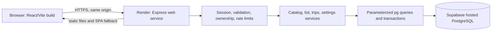
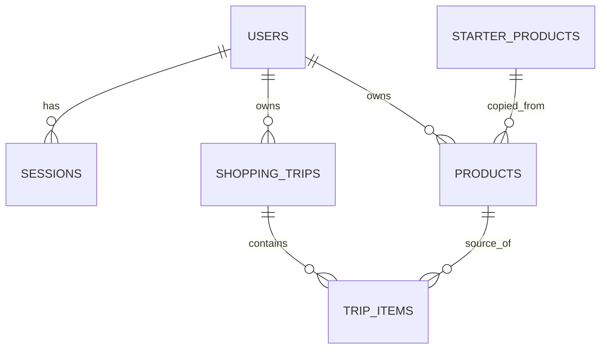

# CartCheck technical system design

**Status:** Approved planning baseline (2026-09-24). This document proposes implementation contracts; no application code or hosted database has been changed.

## Basis and change from the earlier design

Follow the [product requirements](../PRODUCT_REQUIREMENTS.md), [scope](../PROJECT_SCOPE.md), [user flows](../USER_FLOWS.md), and [design specification](../design/README.md). CartCheck is primarily a checklist. The previous unit-price model and per-product price-history queries are removed; estimated and actual **item totals** are independent, optional amounts. This trades automatic last-paid suggestions and unit-price comparisons for faster entry. Dated trip history and corrections remain.

The current repository is still the professor's HAUnted Sightings starter: React/Vite client, Express API, `pg` PostgreSQL access, a localStorage mock, health checks, and a client-only Pages workflow. Reuse the package boundaries and useful API/validation patterns. Replace sightings data only in implementation milestones. The Pages preview and localStorage mock cannot be the private final application.

## 1. Runtime architecture and hosting

One Render web service serves `client/dist` and `/api`. Vite proxies `/api` to Express during local development. The database connection string exists only on the server as `DATABASE_URL`; no database URL or secret key goes in a `VITE_` variable. Keep `GET /healthz` and `GET /readyz`. Production fails visibly when its API/database configuration is unavailable and never silently switches to the mock.

Render is a persistent Node backend, so use a direct Supabase PostgreSQL connection when its networking supports IPv6; otherwise use Supabase's session-mode pooler. Choose the actual endpoint from the project's **Connect** panel after both accounts exist, use TLS, and cap the `pg` pool to the project's connection allowance. Do not assume a pooler hostname or use transaction pooling without evaluating its session limitations. Local/disposable PostgreSQL remains the development and test target; do not create tables or alter a Supabase project as part of this planning revision.

Supabase initially supplies PostgreSQL only. Keep all browser data access through Express and disable the Supabase Data API if it is unused. Put app tables in a non-exposed schema where practical, restrict database role privileges, and enforce ownership in server queries. If any table is later exposed through Supabase Data API, grant only intended access and enable matching row-level security before use. Do not expose a service-role or database credential in the client.

## 2. Components and rules

| Component | Responsibility |
| --- | --- |
| React shell and screens | Auth gate; Cart, Catalog, Trips, Settings navigation; responsive checklist and secondary money controls. |
| Client API facade | Named HTTP requests, cookie credentials, normalized loading and errors; fictitious mock fixtures only for isolated UI work. |
| Express routes | Authenticate, validate, handle status codes, return decimal strings and predictable JSON. |
| Services | Catalog resolution, list mutations/totals, transaction-safe finish and correction. |
| Repositories | Parameterized SQL with account ownership predicates and transactions. |
| PostgreSQL | Durable accounts, sessions, shared starter items, private catalog items, one active trip and completed snapshots. |

Starter rows are read-only templates without prices. On registration, copying approximately 100 templates into the shopper's private catalog gives stable owner-scoped product IDs and private edits. A new custom catalog item is private. Registering it returns the shopper to the add step; it does not silently add a list entry.

One catalog product has at most one entry in the active trip. Selecting it again opens a prefilled edit; `PUT` sets absolute desired entry values, so a retry cannot increase quantity. The entry's displayed name can differ from the catalog name without changing the catalog. A later catalog edit cannot rewrite an active or completed item snapshot.

### Amounts and completion

- `estimated_total` and `actual_total` are nullable nonnegative **item totals**, never unit prices. Quantity does not multiply either amount. Blank and `0.00` are distinct.
- The estimated list subtotal sums known estimates for all entries and reports how many estimates are missing. Recorded spending sums known actual totals on **bought** entries and reports how many bought entries lack an actual amount. Unbought actual amounts, if entered in error, do not count toward spending.
- A budget comparison uses the known estimated subtotal while planning and known recorded spending at finish. Whenever relevant prices are missing, label the comparison incomplete; do not imply that the known subtotal is the full amount. No price or budget is needed to mark bought or finish.
- Supported currencies are **PHP, USD, EUR**, each with two decimal places. The account preference defaults to PHP; changing it affects new trips only. Every trip retains its currency and no cross-currency sum or conversion occurs.
- Finish Trip posts an explicit active-trip ID and revision. In one transaction, lock the owned trip, verify revision and nonempty item set, set status/completion time, and create a new empty active trip with null budget and the current preference. A retry with the same completed ID returns the existing trip; a stale revision returns `409`. A nonempty trip with no bought items is allowed after review. Unchecked entries remain in the completed trip as **not bought**, with no rollover.
- A past-trip correction submits a reviewed complete proposed item set and revision. Lock the owned completed trip, validate and apply changes transactionally, preserve `completed_at` and currency, and recalculate totals from entries. A stale revision returns `409`.

## 3. Data model

| Table | Main columns and constraints |
| --- | --- |
| `users` | `id`, normalized unique `email`, `password_hash`, `preferred_currency DEFAULT 'PHP'`, timestamps. |
| `sessions` | `id`, `user_id`, unique hashed token, expiry and creation timestamps. |
| `starter_products` | Stable seed `code`, name and category. No brand, variant, package size or price requirement. |
| `products` | `id`, required owner `user_id`, optional `source_starter_code`, name, category, optional `image_url`, timestamps. Unique `(user_id, source_starter_code)` for copied starters. No delete in v1. |
| `shopping_trips` | `id`, owner `user_id`, `status` (`active`/`completed`), `currency`, nullable nonnegative `budget`, integer `revision`, creation and nullable completion timestamps. Partial unique active trip per user. |
| `trip_items` | `id`, `trip_id`, `product_id`, snapshot `name`, `category`, positive `quantity`, optional short `unit_label`, nullable nonnegative `estimated_total`, nullable nonnegative `actual_total`, `bought`. Unique `(trip_id, product_id)`. |

Use `NUMERIC(12,2)` for money and `NUMERIC(12,3)` for quantity. Require positive quantity and limit unit-label length. Money calculations use PostgreSQL `NUMERIC` or an exact decimal helper, not JavaScript floating-point multiplication; send decimal strings in JSON. Validate currency, names, categories, precision, URLs, and ownership in Express, backed by SQL `CHECK`, foreign keys, indexes, and uniqueness constraints. Joined ownership is required when resolving an item or product ID. Unknown or foreign IDs return `404`.

Store item snapshots when added to an active trip and retain them when completed. Corrections update that trip's snapshots only. Index normalized email, session hashes, owner/name product search, owner/completion trip lookup, and item trip/product uniqueness. Numbered migrations manage schema changes; an idempotent grocery seed replaces the starter's destructive sightings seed before any CartCheck database setup. Never run a reset against persistent data.

## 4. API contract

All domain routes are JSON under `/api`. Mutations require a session, origin check, server validation, and ownership; auth routes are rate limited. Use `400` for malformed values, `401` for no session, `404` for missing/foreign records, `409` for stale state, and `429` for rate limits. Do not return SQL details.

| Method | Route | Purpose |
| --- | --- | --- |
| `POST` | `/api/auth/register`, `/api/auth/login`, `/api/auth/logout` | Account and session lifecycle. |
| `GET` | `/api/auth/session` | Restore account and preference. |
| `PATCH` | `/api/me/settings` | Preferred currency for future trips. Theme can remain local. |
| `GET`, `POST` | `/api/products` | Search/filter/paginate private catalog; register custom item. |
| `GET`, `PATCH` | `/api/products/:id` | Private catalog detail/edit. |
| `GET`, `PATCH` | `/api/cart` | Active trip with entries, known totals, missing counts, budget and revision; edit budget. |
| `PUT` | `/api/cart/items/:productId` | Add or set the single entry for a product to absolute desired values. |
| `PATCH`, `DELETE` | `/api/cart/items/:id` | Edit displayed name, category, quantity, unit label, amounts or bought state; remove. |
| `POST` | `/api/carts/:cartId/finish` | Confirm this exact trip using its revision; idempotent retry. |
| `GET` | `/api/trips`, `/api/trips/:id` | Paginated history and itemized detail. |
| `PUT` | `/api/trips/:id` | Confirm a full correction set using expected revision. |
| `GET` | `/healthz`, `/readyz` | Process and database readiness. |

Search is escaped, case-insensitive, bounded, and paginated. Each cart/trip response explicitly distinguishes known subtotals from completeness flags and missing counts. An absent optional amount is JSON `null`, never `0` or an inferred catalog price.

## 5. Frontend and accessibility

Keep the existing React/Vite package and API facade. A small app shell and feature modules need no state-management framework. The primary destinations remain Cart, Catalog, Trips, and Settings. Quick add and item editing should take fewer steps than optional money entry. A custom-item form asks for name and category, with optional image URL; do not create a price-history page. A finished trip detail includes a correction review.

Use [DESIGN_SYSTEM.md](../design/DESIGN_SYSTEM.md): semantic controls, visible focus, loading/empty/error states, phone portrait and landscape, desktop, light/dark, 200% zoom, reduced motion, and dialog focus return. Prices and budgets should not occupy the primary list controls. Optional images fall back to a neutral placeholder.

## 6. Authentication and security

Keep Express-managed email/password authentication for the first release. This preserves the required Express API and matches the course checklist's bcrypt guidance without adding Supabase Auth or a browser Supabase client. Hash passwords with bcrypt; use an opaque random session token whose hash is stored in PostgreSQL. Send the token in an `HttpOnly`, `Secure` (production), `SameSite=Lax` cookie, revoke on logout, and expire old sessions. Every private repository query constrains by the authenticated owner. This choice can be revisited if the full professor assignment explicitly requires another auth mechanism; that instruction is not present in this repository.

Serve browser and API on one HTTPS origin, check Origin on mutations, restrict development CORS, use `helmet`, rate-limit account endpoints, and keep secrets out of code and screenshots. Do not collect unnecessary personal data. Supabase's hosted database is not a reason to expose a direct browser data path.

## 7. Verification and delivery

- Domain tests: quantity precision, absolute duplicate-add updates, independent estimated/actual item totals, missing versus zero, budget incompleteness, and currency isolation.
- Disposable PostgreSQL/API integration: registration and logout, two-account isolation across resource families, idempotent starter seed, catalog/list snapshot stability, stale revisions, duplicate finish retry, unpriced bought items, unchecked snapshots, and trip correction totals.
- Client walkthrough: complete checklist-only trip and priced trip against the real API; empty/loading/error states, keyboard/dialog focus, 320px portrait, landscape, desktop, dark mode and 200% zoom.
- Release: public HTTPS full flow on Render with Supabase PostgreSQL, refresh nested routes, health/readiness, production mock disabled, dependency audit, security/privacy checklist, and course deliverables.

Tests and migrations must target disposable data until a hosted project is deliberately configured. Do not reset persistent Supabase data.

Provider details should be checked again at setup: [Supabase PostgreSQL connection modes](https://supabase.com/docs/guides/database/connecting-to-postgres), [Supabase Data API security and disablement](https://supabase.com/docs/guides/api/securing-your-api), and [Render Express deployment](https://render.com/docs/deploy-node-express-app). The current proposal does not depend on Supabase Auth, Data API, Realtime, or Storage.

## Decisions retained

One active trip per account, private copies of starter catalog items, historical item snapshots, optimistic revisions plus transaction locks, and one production origin remain. They add modest schema and request handling but protect privacy, history accuracy, and duplicate Finish Trip behavior. PHP/USD/EUR, unchecked-as-not-bought, absolute duplicate-add edits, optional separate item totals, and Render plus Supabase hosting are approved scope decisions.
