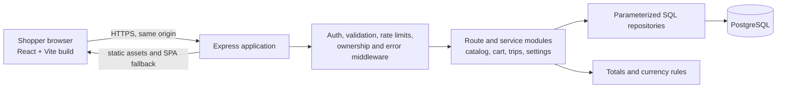
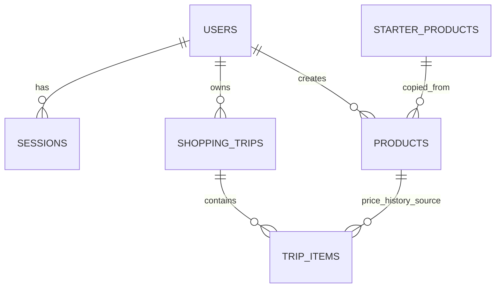

# CartCheck technical system design

**Status:** Proposed for review; no application implementation is authorized by this document.

## Basis and boundaries

This design follows [product requirements](../PRODUCT_REQUIREMENTS.md), [project scope](../PROJECT_SCOPE.md), [user flows](../USER_FLOWS.md), and the [UI/UX specification](../design/README.md). Those files still carry draft/proposed labels, while the current task states that the requirements and design have been established. The behavior described there is the working baseline. The short supported-currency list remains an explicit review choice below.

The professor's starter is a working **HAUnted Sightings** example, not a CartCheck implementation: React 18 and Vite 6 in `client/`, plain JavaScript, an HTTP/mock API facade, Express 4 and `pg` in `server/`, PostgreSQL 17 in Compose, health checks, and a client-only GitHub Pages workflow. It has no authentication, migrations, tests, or grocery domain. Reuse the stack and useful patterns (API facade, parameterized repository queries, server validation, loading/error states, readiness endpoint). Replace the sightings schema, routes, demo data, and UI in implementation milestones. Do not treat the localStorage sightings mock or Pages demo as secure account storage.

## 1. System architecture



In development, Vite serves the client and proxies `/api` to Express as the template already does. In production, one HTTPS origin serves both the built React files and Express `/api` routes; the database is reachable only by the server. Build and deploy both packages together, with the API host serving `client/dist`. Keep `GET /healthz` and `GET /readyz`. The existing GitHub Pages workflow can remain a separate nonprivate visual preview while transitioning, but the **delivered account application** must use the real API and PostgreSQL. Production must fail visibly if API configuration is missing; it must not silently fall back to the localStorage mock.

This single-origin plan adds no gateway, SSR framework, hosted auth product, or second runtime. It does require an application host capable of running Node and PostgreSQL, rather than Pages alone. TLS termination may be provided by that host; Express should trust only its configured proxy.

## 2. Main application components

| Component | Responsibility |
| --- | --- |
| React app shell | Auth gate; Cart, Catalog, Trips, Settings navigation; responsive layouts and theme. |
| `client/src/api` facade | Named domain requests, credentials, status/error normalization. Mock adapter only for isolated UI development with fictitious data. |
| Express route modules | Parse requests, authenticate, validate, return predictable JSON/status codes. Thin handlers. |
| Domain services | Catalog resolution, cart mutations and totals, finish-trip transaction, trip correction, last-paid query. |
| SQL repositories | Parameterized queries with account ownership predicates and explicit transactions. |
| PostgreSQL | Durable accounts, sessions, reusable products, one active cart per account, finished trips and immutable-at-creation item snapshots. |

The ~100 starter rows are read-only seed templates. Registration copies them into that shopper's private product catalog. This uses a little more storage but gives every catalog query a simple owner rule and a stable private product ID; later template changes do not overwrite shopper edits. A shopper may also register a custom product. Registering does **not** add it to the cart; the flow returns to the add step. A product can appear only once in a cart. Re-adding sets an absolute desired quantity and price rather than an increment that a network retry could repeat. If the product's current unit differs from the existing cart snapshot, require an explicit replacement/edit instead of silently merging quantities.

### Core workflows and consistency

* **Cart totals:** Server computes each priced line as `ROUND(quantity × unit_price, 2)`, then sums rounded lines. Return estimated total for all priced entries, bought subtotal for checked entries, and unknown-price counts. Mark estimates incomplete whenever a relevant price is null. `0.00` is a known price. The active-cart remaining/over amount compares budget with the planned estimate; the finish review compares budget with the checked-item total. A warning never blocks finishing.
* **Finish Trip:** Client presents bought and unbought item snapshots, then posts the **explicit cart ID** and revision. One PostgreSQL transaction locks that owned `shopping_trips` row, checks revision and bought-item prices, changes its status to `completed`, sets its finish date, and creates the next empty `active` trip with a null budget and the account's *current* preferred currency. A retry for the same cart ID returns the existing completed trip; a stale revision returns `409`. Every cart mutation locks the same parent row and increments its revision. Empty-cart finish is rejected; a nonempty cart with no bought items is allowed after explicit review. Unchecked items are archived as **not bought**, with no automatic rollover.
* **Trip correction:** Client reviews a complete proposed item set before submitting it with the trip revision. A transaction locks the owned completed trip, validates all items, replaces/adds/removes its snapshot rows, and increments revision. Preserve `completed_at` and trip currency. A stale revision returns `409`. Recalculate totals from the current trip items rather than maintaining a second cache. Product last-paid and price history are derived from bought trip items, so corrections immediately affect them.
* **Product changes:** Each cart/trip item stores its selected name/category/unit snapshot on addition. Later catalog edits cannot reinterpret an active item's unit or rewrite history. To use a changed unit in an active cart, explicitly replace the row. Historical price lookup filters by product, currency, and unit and labels both date and source.

## 3. Data model and database design



| Table | Main columns and constraints |
| --- | --- |
| `users` | `id`, normalized unique `email`, `password_hash`, `preferred_currency DEFAULT 'PHP'`, timestamps. No profile data beyond account needs. |
| `sessions` | `id`, `user_id`, unique hashed random session token, `expires_at`, `created_at`; logout removes session. Expired rows are pruned. |
| `starter_products` | Stable seed `code`, name, category, unit (`each`, `kg`, `L`); no invented current price. Read-only after seeding. |
| `products` | `id`, required `user_id`, optional `source_starter_code`, name/category/unit, optional `image_url`, nullable nonnegative `reference_price` plus `reference_currency`, timestamps. Unique `(user_id, source_starter_code)` for copied starters. No product deletion in v1. |
| `shopping_trips` | `id`, `user_id`, `status` (`active`/`completed`), `currency`, nullable nonnegative `budget`, integer `revision`, `created_at`, nullable `completed_at`. Partial unique `(user_id) WHERE status='active'` enforces one active cart. Date and currency remain fixed after completion. |
| `trip_items` | `id`, `trip_id`, `product_id`, snapshot name/category/unit, positive quantity, nullable nonnegative unit price, bought flag. Unique `(trip_id, product_id)` prevents duplicate lines. Unbought items may have unknown price. |

Use PostgreSQL `NUMERIC(12,2)` for prices and budgets and `NUMERIC(12,3)` for quantities. Restrict `each` to whole quantities in server validation and database checks; `kg`/`L` allow up to three decimal places. Calculate line totals and sums with PostgreSQL `NUMERIC` (or an exact decimal-string/fixed-point helper for pure tests), never JavaScript `Number` multiplication. Return decimal values as **strings** in JSON and format by trip currency in the client. The first release should support a small list of two-decimal currencies, proposed **PHP, USD, EUR**. Validate the code on both client and server. New carts copy the setting; existing carts and trips never convert or relabel amounts. No cross-currency total is produced. A reference price must have a currency when present; when price is null, currency is null too.

Indexes: unique normalized user email, session token hash, `products(user_id, name)`, unique product starter source per user, partial unique active trip per user, `shopping_trips(user_id, completed_at DESC)`, and `trip_items(product_id, bought)` with trip join for dated history. Use `CHECK`, foreign keys, and unique constraints as a second line of validation. Verify that a selected product and trip share the same owner in the service and, where practical, composite foreign keys. Queries for owned records include `user_id` (or join through an owned parent); an unknown or foreign ID returns `404` to avoid disclosing ownership.

Schema changes after first deployment use numbered SQL migrations; `db/schema.sql` remains the readable baseline for a fresh database. The starter `db:seed` truncates sightings and must be replaced with an idempotent grocery catalog seed before any CartCheck database setup. Never run that old reset/seed on retained data.

## 4. API structure

All routes below are JSON under `/api`, except health endpoints. Authentication uses the server-side session cookie. `GET` is read-only; mutating routes require session, CSRF origin check, server validation, and ownership. Use `400` for malformed input, `401` for no session, `404` for missing/foreign resources, `409` for stale revisions or conflicting state, and `429` for rate limits. Error responses use `{ "error": "...", "fields": { ... } }` when field errors exist; do not expose SQL details.

| Method | Path | Purpose |
| --- | --- | --- |
| `POST` | `/api/auth/register`, `/api/auth/login`, `/api/auth/logout` | Create account/session, enter, leave. |
| `GET` | `/api/auth/session` | Current account and settings for page reload/auth gate. |
| `PATCH` | `/api/me/settings` | Preferred currency; affects only future carts. Theme may remain a local UI preference. |
| `GET` | `/api/products?search=&category=&limit=&offset=` | Shopper's catalog, with bounded pagination and labeled price source. |
| `POST` | `/api/products` | Register private product. |
| `GET`, `PATCH` | `/api/products/:id` | Product details and edits to the shopper's private product. |
| `GET` | `/api/products/:id/prices?currency=&unit=` | Dated bought prices and latest paid for that currency/unit. |
| `GET` | `/api/cart` | Active cart, entries, totals, missing-price counts, budget and revision. |
| `PATCH` | `/api/cart` | Edit budget using expected revision. |
| `PUT` | `/api/cart/items/:productId` | Add/set the absolute desired quantity and price for an owned product, using expected revision. |
| `PATCH`, `DELETE` | `/api/cart/items/:id` | Edit/remove owned entry; every mutation increments cart revision. |
| `POST` | `/api/carts/:cartId/finish` | Confirm this exact cart; body carries expected revision. Retrying a completed cart returns that trip. |
| `GET` | `/api/trips` | Paginated newest-first summaries with currency and corrected totals. |
| `GET` | `/api/trips/:id` | Itemized bought/unbought trip with revision and original finish date. |
| `PUT` | `/api/trips/:id` | Confirm full proposed correction set with expected revision. |
| `GET` | `/healthz`, `/readyz` | Process and database checks from template. |

Search is escaped, case-insensitive, bounded, and paginated; categories are a small controlled list. Product detail returns reference price separately from last-paid price, with source and currency labels. The reference price is suggested only when its currency and unit match the cart. An unknown price is JSON `null`, never inferred from a starter product. A last-paid suggestion is copied into a cart entry only after the shopper accepts or edits it.

## 5. Frontend component organization

Keep a small `App` shell and organize by screen/feature rather than introducing a large state framework. React state and focused hooks are sufficient. Use the existing API facade so screens do not import transport details. Navigation can use the browser History API in a small local route layer; add a router dependency only if nested route/focus behavior makes that materially simpler. Preserve search/filter state in URL parameters and scroll/focus where practical.

| Area | Components and behavior |
| --- | --- |
| Shared shell | `AppShell`, `Navigation`, `PageHeader`, `StatusMessage`, `ConfirmDialog`, `Money`, `ProductThumbnail`. Four labeled destinations at all widths. |
| Auth | `SignInPage`, `RegisterPage`, `AuthGate`; distinct loading, invalid credentials, and retry states. |
| Cart | `CartPage`, `BudgetSummary`, `CartItemRow`, `AddItemForm`, `FinishTripReview`; hide checked is local view state only. |
| Catalog | `CatalogPage`, `ProductRow`, `ProductForm`, `ProductDetailPage`, `PriceHistory`; no-result registration preserves search text. |
| Trips | `TripsPage`, `TripDetailPage`, `TripCorrectionForm`, `TripCorrectionReview`; original date stays visible. |
| Settings | Currency preference, theme (`light`, `dark`, `system`), sign out. |

Use the design tokens and patterns in `docs/design/DESIGN_SYSTEM.md`, semantic HTML and CSS. Start at 320px, then check phone landscape and desktop, 200% zoom, keyboard flow, focus return from dialogs, text contrast, and reduced motion. Keep loading, empty, offline/error, unknown-price, over-budget, and success states explicit. Image URLs are optional and fall back to a neutral placeholder; no upload service is needed.

## 6. Authentication and authorization

Use email/password accounts because private persistent data is required. Hash passwords with **bcrypt** as requested by the course security checklist. Generate an opaque random session token with Node `crypto`, store only its hash in PostgreSQL, and send the raw token in an `HttpOnly`, `Secure` (production), `SameSite=Lax` cookie. Rotate/revoke on login/logout and set an expiration. Session lookup adds `user_id` to the request; every private repository query constrains by that ID. Do not send or store tokens in localStorage.

Serve the client and API from one origin in production, restrict CORS to the development Vite origin, check `Origin` on mutating requests, accept only JSON for mutations, and rate-limit registration/login and other abuse-prone endpoints. Use `helmet` for security headers. These two packages and a small rate-limit middleware are justified additions; avoid an external auth service. Validate fields, lengths, numeric precision, URL protocol (`http`/`https`), and ownership on the server. Use parameterized SQL, generic login errors, no credentials in client bundles or repository, and no stack traces in responses. The user interface gives a concise data-use notice and keeps fictitious seed data only.

## 7. Testing and verification strategy

* **Domain tests:** Node's built-in test runner for decimal/rounding rules, `each` versus decimal units, zero versus unknown price, budget warning, currency isolation, and validation. Test the exact API decimal-string contract.
* **Database/API integration:** Run against a disposable PostgreSQL database with migrations and fictitious seed. Cover registration, session persistence/logout, two-account isolation for every resource family, private starter-copy editing, duplicate cart product behavior, stale revision `409`, finish retry returning one trip, bought price requirement, unchecked snapshot, correction changing totals/last-paid, and old snapshot stability after catalog edit.
* **Client verification:** Build with `npm run build`, then walk the defined user flows against the real API. Check both light/dark and loading/empty/error states, keyboard-only and dialog focus, 320px portrait, phone landscape, desktop, and 200% zoom. Add focused component tests if repeated interaction defects emerge; avoid tests that only mirror markup.
* **Deployment verification:** Exercise login and a complete trip on the public HTTPS origin with a real database, check `/healthz` and `/readyz`, refresh a nested URL, confirm account isolation, inspect browser network for cookie and CORS behavior, and confirm production cannot enter mock mode. Run dependency audit and the course security/privacy checklist before release.

No database reset or seed operation should run against persistent deployment data. Test fixtures use a separate database. Milestone gates in [ROADMAP.md](ROADMAP.md) keep verification small and attributable.

## 8. Proposed project folder structure

```text
CartCheck/
├─ client/
│  ├─ src/
│  │  ├─ api/                 # domain facade and HTTP adapter; dev mock fixtures
│  │  ├─ app/                 # App shell, navigation, auth gate, route state
│  │  ├─ features/
│  │  │  ├─ auth/
│  │  │  ├─ cart/
│  │  │  ├─ catalog/
│  │  │  ├─ trips/
│  │  │  └─ settings/
│  │  ├─ components/          # shared accessible UI primitives
│  │  ├─ lib/                 # formatting and view-only helpers
│  │  └─ styles/              # tokens and responsive layouts
│  └─ package.json
├─ server/
│  ├─ server.js               # boot and static asset serving
│  ├─ app.js                  # Express configuration/middleware
│  ├─ routes/                 # auth, products, cart, trips, settings
│  ├─ services/               # transactions and domain rules
│  ├─ repos/                  # owned parameterized SQL
│  ├─ middleware/             # session, validation, errors, rate limit
│  ├─ lib/                    # money and validation helpers
│  ├─ db/
│  │  ├─ schema.sql           # fresh-install schema
│  │  ├─ migrations/          # numbered incremental SQL
│  │  └─ seed-products.sql    # idempotent starter templates
│  └─ test/                   # node:test unit and DB/API integration
├─ docs/
│  ├─ architecture/           # this design and roadmap
│  └─ design/                 # approved UI/UX guidance
└─ compose.yml                # local or self-hosted PostgreSQL/API
```

This is a target structure, not a request to move files before their implementation milestone. Existing `client`/`server` package boundaries and Vite proxy remain. No TypeScript conversion, ORM, queue, cache, analytics service, or state library is needed for the stated scope.

## Decisions and tradeoffs for review

| Decision | Reason and accepted tradeoff |
| --- | --- |
| One production origin | Reliable secure-cookie sessions and simple client API URL; requires a Node-capable web host rather than client-only Pages as the final app. |
| PostgreSQL sessions | Logout/revocation and no browser token storage; adds one small table and periodic expiry cleanup. |
| Private copy of starter templates | Simplifies ownership and editing; stores ~100 product rows per user and later template edits do not propagate. |
| One active/completed trip lifecycle with snapshots | Avoids copying rows at finish and preserves history across catalog edits; stores a few repeated text fields and computes totals on reads. |
| Explicit cart ID, optimistic revisions + transaction locks | Prevents stale review screens and duplicate Finish Trip; requires clients to handle `409` by reloading/reviewing. |
| Two-decimal supported currencies | Keeps money rules clear and safe for first release; currencies with other minor-unit conventions need later schema/formatting work. |
| Native React state and SQL | Fits template and app size; more manual wiring than a framework, with fewer dependencies and less setup. |

**Review choice:** Confirm the initial supported currencies (proposed PHP, USD, EUR). The established rule that unchecked items are archived as not bought and the next cart begins empty is carried forward from the product flows. All other architecture choices above are implementation proposals for this review, not code changes.
