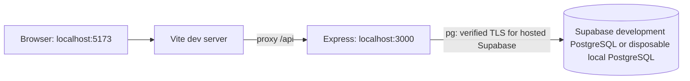
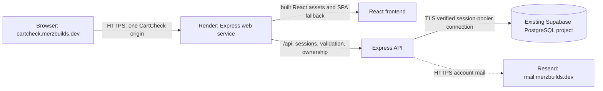
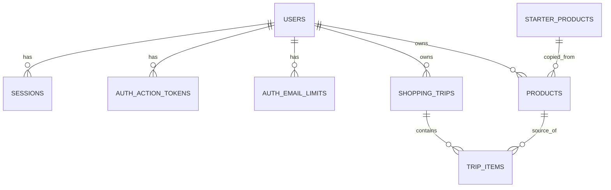

# CartCheck technical system design

**Status:** Completed application (2026-10-06). This document describes the delivered architecture, including multiple named lists. The [migration guide](../MIGRATIONS.md) covers upgrades for installations using an older schema.

## Basis and change from the earlier design

Follow the [product requirements](../PRODUCT_REQUIREMENTS.md) and [design specification](../design/README.md). CartCheck is primarily a checklist. The previous unit-price model and per-product price-history queries are removed; estimated and actual **item totals** are independent, optional amounts. This trades automatic last-paid suggestions and unit-price comparisons for faster entry. Dated trip history and corrections remain.

The repository now implements CartCheck accounts, catalog, active list, and trip history on the React/Vite and Express/PostgreSQL package boundaries. The GitHub Pages starter workflow and browser-only sightings demo have been removed.

## 1. Runtime architecture and hosting

### Local development (implemented)

```mermaid
flowchart LR
    B[Browser: localhost:5173] --> V[Vite dev server]
    V -->|proxy /api| E[Express: localhost:3000]
    E -->|pg: verified TLS for hosted Supabase| P[(Supabase development PostgreSQL or disposable local PostgreSQL)]
```

The client calls relative `/api` URLs. Vite proxies those requests to Express locally. Supabase provides PostgreSQL only; the browser does not connect to Supabase or Resend.

### Deployed web and database architecture

```mermaid
flowchart LR
    B[Browser: cartcheck.merzbuilds.dev] -->|HTTPS: one CartCheck origin| E[Render: Express web service]
    E -->|built React assets and SPA fallback| F[React frontend]
    E -->|/api: sessions, validation, ownership| A[Express API]
    A -->|TLS verified session-pooler connection| P[(Existing Supabase PostgreSQL project)]
    A -.->|HTTPS account mail| R[Resend: mail.merzbuilds.dev]
```

CartCheck runs as **one Render web service** at [cartcheck.merzbuilds.dev](https://cartcheck.merzbuilds.dev), using the existing Supabase PostgreSQL project. Express serves `client/dist`, handles SPA fallback, and exposes `/api`; the client uses relative API paths. The Render build installs both packages and creates `client/dist` before starting Express. The existing `server/Dockerfile` builds only the server and is not used for this full-stack Render build. The CartCheck hostname is canonical for host-only session cookies, Origin validation, and account links. The default `cartcheck.onrender.com` hostname was disabled after HTTPS verification. [Render custom domains](https://render.com/docs/custom-domains).

If Render Free is chosen, it spins down after 15 minutes without traffic and can take about a minute to wake; on one service, the initial page and API may both wait. The free web service has an ephemeral filesystem, so keep sessions, tokens, and grocery data in PostgreSQL. Render says Free instances are for hobby/testing rather than dependable production service; choose the service tier deliberately before launch. [Render Free](https://render.com/docs/free). Keep `GET /healthz` and `GET /readyz`; readiness checks the database. The database connection string exists only on the server as `DATABASE_URL`; no database URL or secret key goes in a `VITE_` variable.

### Historical alternative evaluated: Vercel frontend plus Render API

The team evaluated hosting the static React build on Vercel with an `/api` rewrite to Render. That split would add a second deployment pipeline and require additional proxy-header, cookie, Origin, caching, and failure-path checks. The owner selected one Render service for CartCheck; the split is not in the release plan. [Vercel rewrites](https://vercel.com/docs/routing/rewrites).

The evaluation identified a need to preserve the browser's `/api` path and host-only cookie behavior across a rewrite, verify `Cookie` and `Set-Cookie` forwarding, set the true browser origin in `CLIENT_ORIGIN` and the Origin allowlist, account for the extra proxy hop, and prevent caching of authenticated API responses. No Vercel rewrite is implemented for CartCheck. [Express proxy guidance](https://expressjs.com/en/guide/behind-proxies/).

Render is a long-running Node backend while awake. It connects through Supabase's **session-mode pooler** with TLS verification using the configured CA secret file. The owner chose to reuse the existing Supabase project because of the free-project limit; a separate production project remains an isolation improvement for later. Keep `DATABASE_URL`, `SSL_CA_FILE`, and database credentials server-side, and cap the `pg` pool within the project's connection allowance. The server rejects URL query parameters, including `sslmode`; TLS is configured through server settings. Review connection count across deploy overlap and restarts; `/readyz` reports database failure. Local private data exports were created around the smoke test, but a full PostgreSQL restore has not been tested. Arrange a tested backup/restore plan or paid retention before relying on the free project for important shopper data. Never reset retained data. [Supabase connection modes](https://supabase.com/docs/guides/database/connecting-to-postgres), [pooling limits](https://supabase.com/docs/guides/database/connecting-to-postgres/pooling-and-limits), [pricing](https://supabase.com/pricing).

Supabase initially supplies PostgreSQL only. Keep all browser data access through Express and disable the Supabase Data API if it is unused. Put app tables in a non-exposed schema where practical, restrict database role privileges, and enforce ownership in server queries. If any table is later exposed through Supabase Data API, grant only intended access and enable matching row-level security before use. Do not expose a service-role or database credential in the client.

## 2. Components and rules

| Component | Responsibility |
| --- | --- |
| React shell and screens | Auth gate; My Lists, Catalog, Trips, Settings navigation; responsive checklist and secondary money controls. |
| Client API facade | Named HTTP requests, cookie credentials, normalized loading and errors; fictitious mock fixtures only for isolated UI work. |
| Express routes | Authenticate, validate, handle status codes, return decimal strings and predictable JSON. |
| Services | Catalog resolution, list mutations/totals, transaction-safe finish and correction. |
| Repositories | Parameterized SQL with account ownership predicates and transactions. |
| PostgreSQL | Durable accounts, sessions, shared starter items, private catalog items, multiple named active trips and completed snapshots. |

Starter rows are read-only templates without prices. On registration, copying 160 templates into the shopper's private catalog gives stable owner-scoped product IDs and private edits. A new custom catalog item is private. Registering it returns the shopper to the add step; it does not silently add a list entry.

One catalog product has at most one entry per active list and may appear independently in several lists. Selecting it again opens a prefilled edit; editing sets absolute desired values, so a retry cannot increase quantity. The entry's displayed name can differ from the catalog name without changing the catalog. A later catalog edit cannot rewrite an active or completed item snapshot.

### Amounts and completion

- `estimated_total` and `actual_total` are nullable nonnegative **item totals**, never unit prices. Quantity does not multiply either amount. Blank and `0.00` are distinct.
- The estimated list subtotal sums known estimates for all entries and reports how many estimates are missing. Recorded spending sums known actual totals on **bought** entries and reports how many bought entries lack an actual amount. Unbought actual amounts, if entered in error, do not count toward spending.
- A budget comparison uses the known estimated subtotal while planning and known recorded spending at finish. Whenever relevant prices are missing, label the comparison incomplete; do not imply that the known subtotal is the full amount. No price or budget is needed to mark bought or finish.
- Supported currencies are **PHP, USD, EUR**, each with two decimal places. The account preference defaults to PHP; changing it affects new trips only. Every trip retains its currency and no cross-currency sum or conversion occurs.
- Finish Trip posts an explicit active-trip ID and revision. In one transaction, lock the owned trip, verify revision and nonempty item set, set status/completion time, and retain the completed snapshot without creating a replacement list. Return to My Lists without changing other lists. A retry with the same completed ID returns the existing trip; a stale revision returns `409`. A nonempty trip with no bought items is allowed after review. Unchecked entries remain in the completed trip as **not bought**, with no rollover.
- A past-trip correction submits a reviewed complete proposed item set and revision. Lock the owned completed trip, validate and apply changes transactionally, preserve `completed_at` and currency, and recalculate totals from entries. A stale revision returns `409`.

## 3. Data model

```mermaid
erDiagram
    USERS ||--o{ SESSIONS : has
    USERS ||--o{ AUTH_ACTION_TOKENS : has
    USERS ||--o{ AUTH_EMAIL_LIMITS : has
    USERS ||--o{ PRODUCTS : owns
    USERS ||--o{ SHOPPING_TRIPS : owns
    STARTER_PRODUCTS ||--o{ PRODUCTS : copied_from
    SHOPPING_TRIPS ||--o{ TRIP_ITEMS : contains
    PRODUCTS ||--o{ TRIP_ITEMS : source_of
```

| Table | Main columns and constraints |
| --- | --- |
| `users` | `id`, normalized unique `email`, `password_hash`, `preferred_currency DEFAULT 'PHP'`, email verification and legacy exemption flags (migration 003), timestamps. |
| `sessions` | `id`, `user_id`, unique hashed token, expiry and creation timestamps. |
| `auth_action_tokens`, `auth_email_limits` | Migration 003: hashed one-use verification/reset tokens, expiry, and persisted per-account email cooldowns. |
| `starter_products` | Stable seed `code`, name and category. No brand, variant, package size or price requirement. |
| `products` | `id`, required owner `user_id`, optional `source_starter_code`, name, category, optional `image_url`, timestamps. Unique `(user_id, source_starter_code)` for copied starters. Owner-scoped editing and deletion. |
| `shopping_trips` | `id`, owner `user_id`, `status` (`active`/`completed`), `currency`, nullable nonnegative `budget`, integer `revision`, required trimmed Unicode name (at most 100 code points), update/creation and nullable completion timestamps. Multiple active trips per user; owner/update-time index. |
| `trip_items` | `id`, `trip_id`, `product_id`, snapshot `name`, `category`, positive `quantity`, optional short `unit_label`, nullable nonnegative `estimated_total`, nullable nonnegative `actual_total`, `bought`. Unique `(trip_id, product_id)`. |

Use `NUMERIC(12,2)` for money and `NUMERIC(12,3)` for quantity. Require positive quantity and limit unit-label length. Money calculations use PostgreSQL `NUMERIC` or an exact decimal helper, not JavaScript floating-point multiplication; send decimal strings in JSON. Validate currency, names, categories, precision, URLs, and ownership in Express, backed by SQL `CHECK`, foreign keys, indexes, and uniqueness constraints. Joined ownership is required when resolving an item or product ID. Unknown or foreign IDs return `404`.

Store item snapshots when added to an active trip and retain them when completed. Corrections update that trip's snapshots only. Index normalized email, session hashes, owner/name product search, owner/completion trip lookup, and item trip/product uniqueness. Numbered migrations manage schema changes; an idempotent grocery seed replaces the starter's destructive sightings seed before any CartCheck database setup. Never run a reset against persistent data.

## 4. API contract

All domain routes are JSON under `/api`. Private mutations require a session, origin check, server validation, and ownership; public auth mutations require an origin check and are rate limited. Use `400` for malformed values, `401` for no session, `404` for missing/foreign records, `409` for stale state, and `429` for rate limits. Do not return SQL details.

| Method | Route | Purpose |
| --- | --- | --- |
| `POST` | `/api/auth/register`, `/api/auth/login`, `/api/auth/logout` | Account and session lifecycle. |
| `GET` | `/api/auth/me`, `/api/auth/session` | Restore account and preference. |
| `POST` | `/api/auth/resend-verification`, `/api/auth/verify-email`, `/api/auth/forgot-password`, `/api/auth/reset-password`, `/api/auth/change-password` | Email verification, recovery, and authenticated password changes. |
| `PATCH` | `/api/me/settings` | Preferred currency for future trips. Theme can remain local. |
| `GET`, `POST` | `/api/catalog` | Search/filter private catalog; register custom item. |
| `PATCH`, `DELETE` | `/api/catalog/:id` | Private catalog edit/delete. |
| `GET`, `POST` | `/api/lists` | Paginated active-list summaries; explicitly create an empty named list. |
| `GET`, `PATCH`, `DELETE` | `/api/lists/:id` | Read an owned active list; rename/edit budget; delete after confirmation. |
| `POST` | `/api/lists/:id/items` | Add a product to the selected list; duplicate selection is handled by the client edit flow. |
| `PATCH`, `DELETE` | `/api/lists/:id/items/:itemId` | Edit displayed name, category, quantity, unit label, amounts or bought state; remove. |
| `POST` | `/api/trips/:id/finish` | Confirm this exact trip using its revision; idempotent retry. |
| `GET` | `/api/trips`, `/api/trips/:id` | Paginated history and itemized detail. |
| `PUT` | `/api/trips/:id` | Confirm a full correction set using expected revision. |
| `GET` | `/healthz`, `/readyz` | Process and database readiness. |

Search is escaped, case-insensitive, bounded, and paginated. Each cart/trip response explicitly distinguishes known subtotals from completeness flags and missing counts. An absent optional amount is JSON `null`, never `0` or an inferred catalog price.

## 5. Frontend and accessibility

Keep the existing React/Vite package and API facade. A small app shell and feature modules need no state-management framework. The primary destinations are My Lists, Catalog, Trips, and Settings. Quick add and item editing should take fewer steps than optional money entry. A custom-item form asks for name and category, with optional image URL; do not create a price-history page. A finished trip detail includes a correction review.

Use [DESIGN_SYSTEM.md](../design/DESIGN_SYSTEM.md): semantic controls, visible focus, loading/empty/error states, phone portrait and landscape, desktop, light/dark, 200% zoom, reduced motion, and dialog focus return. Prices and budgets should not occupy the primary list controls. Optional images fall back to a neutral placeholder.

### Client data ownership

The October 9 release also treats a shared-cookie change in another tab as a session boundary. It revalidates identity before focus/online refresh, uses a credential-free cross-tab notification, discards private state on a confirmed boundary, and supplies the rendered account ID on private API requests. Express compares this hint with the authenticated cookie identity before accessing data. The hint is a consistency check, never an authorization source; server ownership predicates remain authoritative. All `/api` responses carry `Cache-Control: no-store`. These controls were released in approved commit `0db7eb7` after CI passed.

Private screens share an account-session in-memory cache through `DataCacheProvider` and `useDataQuery`. Active-list summaries, complete catalog, and the first history-summary page prefetch concurrently after session restoration. Lists/history use a 30-second stale period; catalog and bounded lazy trip details remain cached until changed or explicitly refreshed. Cached content survives background refresh/error. Reads deduplicate, accept abort signals, and use version guards; optimistic mutation locks prevent stale GETs replacing writes. Session/provider disposal aborts and clears private resources. Server persistence, ownership checks, and revision-based Finish/correction confirmation remain authoritative. List detail caches and mutations are scoped by list ID; reads deduplicate and optimistic writes reconcile API responses without full-list refetches.

## 6. Authentication and security

Keep Express-managed email/password authentication and one CartCheck session system for the first release. This preserves the existing Express API without adding Supabase Auth or a browser Supabase client. Passwords are bcrypt hashed; an opaque random session token has its hash stored in PostgreSQL. The cookie is `HttpOnly`, `Secure` in production, and `SameSite=Lax`; logout revokes it. Password reset/change revokes local sessions. Every private repository query constrains by the authenticated owner. Migration 003 keeps preexisting accounts exempt from mandatory verification; `REQUIRE_VERIFIED_EMAIL` configures enforcement for new accounts.

Serve browser and API on one HTTPS origin, check Origin on mutations, restrict CORS, use `helmet`, rate-limit account endpoints, and keep secrets out of code and screenshots. Configure `CLIENT_ORIGIN` to the exact public CartCheck origin for verification/reset links and `CORS_ORIGINS` to intended browser origins; do not use a wildcard. Test `HttpOnly`, `Secure`, and `SameSite=Lax` cookie behavior through HTTPS, login/logout, refresh, cross-origin mutation rejection, and account recovery. No CDN or reverse proxy should cache personalized API responses. Do not collect unnecessary personal data. Supabase's hosted database is not a reason to expose a direct browser data path.

### Authentication decision

Google Sign-In was evaluated during planning and cancelled by the owner. The existing Express email/password system, including account recovery and CartCheck sessions, is the chosen authentication system. No Google provider or account-linking work is in the release plan.

## 7. Transactional email

The Express mail adapter calls Resend's HTTPS API. Configure `RESEND_API_KEY`, `EMAIL_FROM`, and `CLIENT_ORIGIN` on the server. Web routing and email DNS authentication are separate: use provider-supplied records for the selected sending domain and verify delivery before requiring confirmation.

Test real inbox delivery, verification/reset links, token expiry and replay protection, rejection, and quota handling before enabling `REQUIRE_VERIFIED_EMAIL=true`. Existing accounts retain their legacy exemption. Follow the [account email setup guide](../ACCOUNT_EMAIL_SETUP.md).

## 8. Verification and delivery

- Domain tests: quantity precision, absolute duplicate-add updates, independent estimated/actual item totals, missing versus zero, budget incompleteness, and currency isolation.
- Disposable PostgreSQL/API integration: registration and logout, two-account isolation across resource families, idempotent starter seed, catalog/list snapshot stability, stale revisions, duplicate finish retry, unpriced bought items, unchecked snapshots, and trip correction totals.
- Client walkthrough: complete checklist-only trip and priced trip against the real API; empty/loading/error states, keyboard/dialog focus, 320px portrait, landscape, desktop, dark mode and 200% zoom.
- Release: public HTTPS full flow on Render with Supabase PostgreSQL, refresh nested routes, health/readiness, production mock disabled, dependency audit, security/privacy checks. Include cold-start behavior, cookie/Origin/CORS checks, mail delivery, and two-account isolation.

Tests and migrations must target disposable data until a hosted project is deliberately configured. Do not reset persistent Supabase data.

Provider details should be checked again at setup: [Supabase PostgreSQL connection modes](https://supabase.com/docs/guides/database/connecting-to-postgres), [Supabase Data API security and disablement](https://supabase.com/docs/guides/api/securing-your-api), and [Render Express deployment](https://render.com/docs/deploy-node-express-app). The application does not depend on Supabase Auth, Data API, Realtime, or Storage.

## 9. Schema compatibility

Multiple lists require migration 004 and the matching client/server. Old application writers must stop before the old unique index is removed. See the [migration guide](../MIGRATIONS.md) for preflight, backup, coordinated release, and rollback constraints. Keep dated provider status and production evidence in the local archive.

Private catalog copies, historical item snapshots, optimistic revisions with transaction locks, explicit account/list ownership, and one production origin protect privacy, history accuracy, and duplicate Finish Trip behavior. Optional separate item totals, PHP/USD/EUR currency snapshots, and unchecked-as-not-bought completion remain approved requirements.
