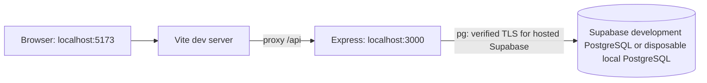
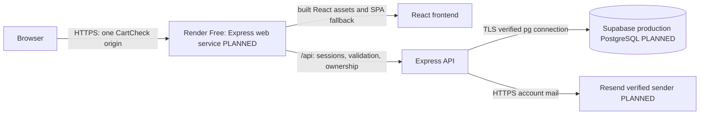
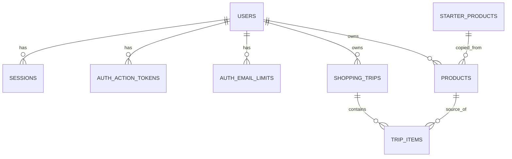

# CartCheck technical system design

**Status (2026-09-29):** Milestones 1–7 are complete. Account enhancements are implemented and tested locally. The single-Render deployment below is the recommended architecture; the personal domain, Resend delivery, public deployment, and Google Sign-In are not yet configured or verified.

## Basis and change from the earlier design

Follow the [product requirements](../PRODUCT_REQUIREMENTS.md), [scope](../PROJECT_SCOPE.md), [user flows](../USER_FLOWS.md), and [design specification](../design/README.md). CartCheck is primarily a checklist. The previous unit-price model and per-product price-history queries are removed; estimated and actual **item totals** are independent, optional amounts. This trades automatic last-paid suggestions and unit-price comparisons for faster entry. Dated trip history and corrections remain.

The repository now implements CartCheck accounts, catalog, active list, and trip history on the React/Vite and Express/PostgreSQL package boundaries. The GitHub Pages starter workflow and browser-only sightings demo have been removed.

## 1. Runtime architecture and hosting

### Local development (implemented)

```mermaid
flowchart LR
    B[Browser: localhost:5173] --> V[Vite dev server]
    V -->|proxy /api| E[Express: localhost:3000]
    E -->|pg: verified TLS for hosted Supabase| P[(Supabase development PostgreSQL or disposable local PostgreSQL)]
```

The client calls relative `/api` URLs. Vite proxies those requests to Express locally. Supabase provides PostgreSQL only; the browser does not connect to Supabase or Resend.

### Production recommendation (planned, not deployed)

```mermaid
flowchart LR
    B[Browser] -->|HTTPS: one CartCheck origin| E[Render Free: Express web service PLANNED]
    E -->|built React assets and SPA fallback| F[React frontend]
    E -->|/api: sessions, validation, ownership| A[Express API]
    A -->|TLS verified pg connection| P[(Supabase production PostgreSQL PLANNED)]
    A -->|HTTPS account mail| R[Resend verified sender PLANNED]
```

Choose **one Render web service** for CartCheck's first public course/portfolio deployment. The existing Express entry point already serves `client/dist`, handles SPA fallback, and exposes `/api`; the client uses relative API paths. The production build must install both packages and create `client/dist` before starting Express; the existing `server/Dockerfile` builds only the server and is not a ready full-stack Render build. Choose one **canonical browser hostname** to keep host-only session cookies, Origin validation, account links, and future Google configuration straightforward. A personal domain could later assign the CartCheck app a subdomain such as `cartcheck.merzbuilds.com`; that name is only an example until registration and setup. A separate portfolio at the apex can use Vercel or another host independently of CartCheck. Render keeps its default `onrender.com` URL reachable after a custom domain is attached unless it is disabled; before launch, either disable it after verifying the custom domain or add and test a canonical redirect/host policy. Host-only cookies do not transfer between the two hosts. [Render custom domains](https://render.com/docs/custom-domains).

Render Free spins down after 15 minutes without traffic and can take about a minute to wake. On one service, the initial page and API may both wait; a separate static frontend would load before the API but would **not** remove API wake time. The free web service has an ephemeral filesystem, so keep sessions, tokens, and grocery data in PostgreSQL. Render explicitly says Free instances are for hobby/testing and should not be used for production applications. The owner must accept that limitation for a public course demo or choose a paid tier before promising dependable service. [Render Free](https://render.com/docs/free). Keep `GET /healthz` and `GET /readyz`; readiness checks the database. The database connection string exists only on the server as `DATABASE_URL`; no database URL or secret key goes in a `VITE_` variable.

### Alternative considered: Vercel frontend plus Render API

Vercel can host the static React build and rewrite the browser's `/api/:path*` requests to a Render origin without changing the browser URL. That is a viable later option if static availability, preview deployments, or independent frontend releases justify two services. It adds Vercel configuration, two deployment pipelines, proxy-header and cookie testing, and an additional failure path. Vercel Hobby is for non-commercial personal use, with its own limits. CartCheck has no current need that offsets this extra work. [Vercel rewrites](https://vercel.com/docs/routing/rewrites), [Hobby plan](https://vercel.com/docs/plans/hobby).

If the split is approved later, keep `VITE_API_BASE_URL` unset so the browser still requests `/api` on the Vercel site. Rewrite `/api/:path*` to the matching Render `/api/:path*`; never turn it into a browser redirect. Verify that `Cookie` reaches Render and `Set-Cookie` returns unchanged to the browser, with a host-only `HttpOnly; Secure; SameSite=Lax` cookie scoped to the visible frontend host. Set `CLIENT_ORIGIN` and the Origin allowlist to the **actual frontend** HTTPS origin; preview domains need deliberate treatment. Test that the backend's `Host`, `Origin`, `X-Forwarded-Host`, `X-Forwarded-Proto`, and client IP are interpreted correctly rather than assuming the rewrite preserves them. The current Origin check compares `Origin` with `Host` or an explicit allowlist, and `app.set('trust proxy', 1)` reflects a one-proxy assumption. A Vercel-to-Render path adds a proxy; do not broadly trust all forwarded headers or guess the hop count. [Express proxy guidance](https://expressjs.com/en/guide/behind-proxies/). Explicitly prevent caching of authenticated `/api` responses and verify it at the deployed URL; proxy caching behavior can vary by configuration. The Render default URL may remain separately reachable, so verify allowed origins and cookie behavior on both entry points. Exercise login, logout, refresh/session restoration, mutation CSRF rejection, recovery links, and error handling before any cutover. No rewrite is implemented now.

Render is a long-running Node backend while awake. Plan on Supabase's **session-mode pooler** for Render's IPv4 network; choose a direct connection only if the deployed network actually supports IPv6. The development project currently uses the session pooler with TLS certificate verification. For production, prefer a separate Supabase project and credentials so guarded development checks cannot touch live accounts. Choose the actual endpoint from each project's **Connect** panel, use verified TLS (and its CA file if needed), and cap the `pg` pool with `DB_POOL_MAX` within the project's connection allowance. Keep `DATABASE_URL`, optional `SSL_CA_FILE`, and database credentials server-side. The current server rejects URL query parameters, including `sslmode`; configure TLS through its existing server settings. Do not assume a pooler hostname or use transaction pooling without evaluating its session limitations. Review connection count across deploy overlap and restarts; `/readyz` must report database failure. Free Supabase can pause inactive projects and does not include automatic backups; agree on export/restore or paid retention before relying on live shopper data. Do not apply migrations or reset retained development data as part of this planning update. [Supabase connection modes](https://supabase.com/docs/guides/database/connecting-to-postgres), [Render IPv4 compatibility](https://supabase.com/docs/guides/troubleshooting/supabase--your-network-ipv4-and-ipv6-compatibility-cHe3BP), [pooling limits](https://supabase.com/docs/guides/database/connecting-to-postgres/pooling-and-limits), [pricing](https://supabase.com/pricing).

Supabase initially supplies PostgreSQL only. Keep all browser data access through Express and disable the Supabase Data API if it is unused. Put app tables in a non-exposed schema where practical, restrict database role privileges, and enforce ownership in server queries. If any table is later exposed through Supabase Data API, grant only intended access and enable matching row-level security before use. Do not expose a service-role or database credential in the client.

## 2. Components and rules

| Component | Responsibility |
| --- | --- |
| React shell and screens | Auth gate; Cart, Catalog, Trips, Settings navigation; responsive checklist and secondary money controls. |
| Client API facade | Named HTTP requests, cookie credentials, normalized loading and errors; fictitious mock fixtures only for isolated UI work. |
| Express routes | Authenticate, validate, handle status codes, return decimal strings and predictable JSON. |
| Services | Catalog resolution, list mutations/totals, transaction-safe finish and correction. |
| Repositories | Parameterized SQL with account ownership predicates and transactions. |
| PostgreSQL | Durable accounts, sessions, shared starter items, private catalog items, one active trip and completed snapshots. |

Starter rows are read-only templates without prices. On registration, copying approximately 100 templates into the shopper's private catalog gives stable owner-scoped product IDs and private edits. A new custom catalog item is private. Registering it returns the shopper to the add step; it does not silently add a list entry.

One catalog product has at most one entry in the active trip. Selecting it again opens a prefilled edit; editing sets absolute desired values, so a retry cannot increase quantity. The entry's displayed name can differ from the catalog name without changing the catalog. A later catalog edit cannot rewrite an active or completed item snapshot.

### Amounts and completion

- `estimated_total` and `actual_total` are nullable nonnegative **item totals**, never unit prices. Quantity does not multiply either amount. Blank and `0.00` are distinct.
- The estimated list subtotal sums known estimates for all entries and reports how many estimates are missing. Recorded spending sums known actual totals on **bought** entries and reports how many bought entries lack an actual amount. Unbought actual amounts, if entered in error, do not count toward spending.
- A budget comparison uses the known estimated subtotal while planning and known recorded spending at finish. Whenever relevant prices are missing, label the comparison incomplete; do not imply that the known subtotal is the full amount. No price or budget is needed to mark bought or finish.
- Supported currencies are **PHP, USD, EUR**, each with two decimal places. The account preference defaults to PHP; changing it affects new trips only. Every trip retains its currency and no cross-currency sum or conversion occurs.
- Finish Trip posts an explicit active-trip ID and revision. In one transaction, lock the owned trip, verify revision and nonempty item set, set status/completion time, and create a new empty active trip with null budget and the current preference. A retry with the same completed ID returns the existing trip; a stale revision returns `409`. A nonempty trip with no bought items is allowed after review. Unchecked entries remain in the completed trip as **not bought**, with no rollover.
- A past-trip correction submits a reviewed complete proposed item set and revision. Lock the owned completed trip, validate and apply changes transactionally, preserve `completed_at` and currency, and recalculate totals from entries. A stale revision returns `409`.

## 3. Data model

```mermaid
erDiagram
    USERS ||--o{ SESSIONS : has
    USERS ||--o{ AUTH_ACTION_TOKENS : has
    USERS ||--o{ AUTH_EMAIL_LIMITS : has
    USERS ||--o{ PRODUCTS : owns
    USERS ||--o{ SHOPPING_TRIPS : owns
    STARTER_PRODUCTS ||--o{ PRODUCTS : copied_from
    SHOPPING_TRIPS ||--o{ TRIP_ITEMS : contains
    PRODUCTS ||--o{ TRIP_ITEMS : source_of
```

| Table | Main columns and constraints |
| --- | --- |
| `users` | `id`, normalized unique `email`, `password_hash`, `preferred_currency DEFAULT 'PHP'`, email verification and legacy exemption flags (migration 003), timestamps. |
| `sessions` | `id`, `user_id`, unique hashed token, expiry and creation timestamps. |
| `auth_action_tokens`, `auth_email_limits` | Migration 003: hashed one-use verification/reset tokens, expiry, and persisted per-account email cooldowns. |
| `starter_products` | Stable seed `code`, name and category. No brand, variant, package size or price requirement. |
| `products` | `id`, required owner `user_id`, optional `source_starter_code`, name, category, optional `image_url`, timestamps. Unique `(user_id, source_starter_code)` for copied starters. No delete in v1. |
| `shopping_trips` | `id`, owner `user_id`, `status` (`active`/`completed`), `currency`, nullable nonnegative `budget`, integer `revision`, creation and nullable completion timestamps. Partial unique active trip per user. |
| `trip_items` | `id`, `trip_id`, `product_id`, snapshot `name`, `category`, positive `quantity`, optional short `unit_label`, nullable nonnegative `estimated_total`, nullable nonnegative `actual_total`, `bought`. Unique `(trip_id, product_id)`. |

Use `NUMERIC(12,2)` for money and `NUMERIC(12,3)` for quantity. Require positive quantity and limit unit-label length. Money calculations use PostgreSQL `NUMERIC` or an exact decimal helper, not JavaScript floating-point multiplication; send decimal strings in JSON. Validate currency, names, categories, precision, URLs, and ownership in Express, backed by SQL `CHECK`, foreign keys, indexes, and uniqueness constraints. Joined ownership is required when resolving an item or product ID. Unknown or foreign IDs return `404`.

Store item snapshots when added to an active trip and retain them when completed. Corrections update that trip's snapshots only. Index normalized email, session hashes, owner/name product search, owner/completion trip lookup, and item trip/product uniqueness. Numbered migrations manage schema changes; an idempotent grocery seed replaces the starter's destructive sightings seed before any CartCheck database setup. Never run a reset against persistent data.

## 4. API contract

All domain routes are JSON under `/api`. Private mutations require a session, origin check, server validation, and ownership; public auth mutations require an origin check and are rate limited. Use `400` for malformed values, `401` for no session, `404` for missing/foreign records, `409` for stale state, and `429` for rate limits. Do not return SQL details.

| Method | Route | Purpose |
| --- | --- | --- |
| `POST` | `/api/auth/register`, `/api/auth/login`, `/api/auth/logout` | Account and session lifecycle. |
| `GET` | `/api/auth/me`, `/api/auth/session` | Restore account and preference. |
| `POST` | `/api/auth/resend-verification`, `/api/auth/verify-email`, `/api/auth/forgot-password`, `/api/auth/reset-password`, `/api/auth/change-password` | Implemented account enhancements; public email delivery still unverified. |
| `PATCH` | `/api/me/settings` | Preferred currency for future trips. Theme can remain local. |
| `GET`, `POST` | `/api/catalog` | Search/filter private catalog; register custom item. |
| `PATCH`, `DELETE` | `/api/catalog/:id` | Private catalog edit/delete. |
| `GET`, `PATCH` | `/api/cart` | Active trip with entries, known totals, missing counts, budget and revision; edit budget. |
| `POST` | `/api/cart/items` | Add the single active entry for a product; duplicate selection is handled by the client edit flow. |
| `PATCH`, `DELETE` | `/api/cart/items/:id` | Edit displayed name, category, quantity, unit label, amounts or bought state; remove. |
| `POST` | `/api/trips/:id/finish` | Confirm this exact trip using its revision; idempotent retry. |
| `GET` | `/api/trips`, `/api/trips/:id` | Paginated history and itemized detail. |
| `PUT` | `/api/trips/:id` | Confirm a full correction set using expected revision. |
| `GET` | `/healthz`, `/readyz` | Process and database readiness. |

Search is escaped, case-insensitive, bounded, and paginated. Each cart/trip response explicitly distinguishes known subtotals from completeness flags and missing counts. An absent optional amount is JSON `null`, never `0` or an inferred catalog price.

## 5. Frontend and accessibility

Keep the existing React/Vite package and API facade. A small app shell and feature modules need no state-management framework. The primary destinations remain Cart, Catalog, Trips, and Settings. Quick add and item editing should take fewer steps than optional money entry. A custom-item form asks for name and category, with optional image URL; do not create a price-history page. A finished trip detail includes a correction review.

Use [DESIGN_SYSTEM.md](../design/DESIGN_SYSTEM.md): semantic controls, visible focus, loading/empty/error states, phone portrait and landscape, desktop, light/dark, 200% zoom, reduced motion, and dialog focus return. Prices and budgets should not occupy the primary list controls. Optional images fall back to a neutral placeholder.

## 6. Authentication and security

Keep Express-managed email/password authentication and one CartCheck session system for the first release. This preserves the existing Express API without adding Supabase Auth or a browser Supabase client. Passwords are bcrypt hashed; an opaque random session token has its hash stored in PostgreSQL. The cookie is `HttpOnly`, `Secure` in production, and `SameSite=Lax`; logout revokes it. Password reset/change revokes local sessions. Every private repository query constrains by the authenticated owner. Migration 003 keeps preexisting accounts exempt from mandatory verification; the enforcement flag remains off until public mail delivery is proved.

Serve browser and API on one HTTPS origin, check Origin on mutations, restrict CORS, use `helmet`, rate-limit account endpoints, and keep secrets out of code and screenshots. Configure `CLIENT_ORIGIN` to the exact public CartCheck origin for verification/reset links and `CORS_ORIGINS` to intended browser origins; do not use a wildcard. Test `HttpOnly`, `Secure`, and `SameSite=Lax` cookie behavior through HTTPS, login/logout, refresh, cross-origin mutation rejection, and account recovery. No CDN or reverse proxy should cache personalized API responses. Do not collect unnecessary personal data. Supabase's hosted database is not a reason to expose a direct browser data path.

### Planned Google Sign-In (separate later task)

Google is **not implemented**. If approved later, add it as another credential to the existing Express accounts and issue the same CartCheck session cookie after backend verification. Identify Google identities by verified issuer/client audience and stable `sub`, not by email. Never automatically merge an existing password account using a matching email; linking requires a signed-in account, recent reauthentication, and a fresh Google challenge. Preserve `users.id`, grocery foreign keys, and existing sessions through an additive identity mapping. Protect the chosen GIS/OIDC flow against forged or replayed tokens and login/link CSRF; use state, nonce, and PKCE when the chosen flow calls for them. Google-only recovery belongs to Google; password users retain CartCheck email reset. [Google ID-token verification](https://developers.google.com/identity/gsi/web/guides/verify-google-id-token), [OIDC guidance](https://developers.google.com/identity/openid-connect/openid-connect).

The chosen production browser origin (for example the eventual CartCheck custom subdomain, or the Render URL if launched before domain setup) must be configured as an authorized JavaScript origin in Google Cloud. A GIS JavaScript credential callback needs no redirect URI; a redirect/code flow requires the exact callback URI. Review consent-screen branding, public homepage/privacy information, and domain verification before launch. Localhost and production are distinct configured origins. Do not put Google client secrets in browser variables. [Google web client setup](https://developers.google.com/identity/gsi/web/guides/get-google-api-clientid), [brand verification](https://developers.google.com/identity/protocols/oauth2/production-readiness/brand-verification).

## 7. Personal domain and transactional email (planned)

If a personal domain is purchased, one possible layout is `merzbuilds.com` for a portfolio, `cartcheck.merzbuilds.com` for CartCheck on Render, and `mail.merzbuilds.com` **only as a Resend sending identity** for addresses such as `no-reply@mail.merzbuilds.com`. These are examples, not registered names or configured services. The email subdomain is not the CartCheck web host and does not require its own web service. Other project subdomains can be added later.

At the authoritative DNS provider (possibly Spaceship if it retains nameservers), add the CartCheck subdomain's website record to the Render target shown in its dashboard; a non-root web subdomain typically uses `CNAME`. If a separate portfolio uses Vercel, configure its apex website record and any chosen `www` alias from the Vercel dashboard. These website records route browser traffic. Resend's sending subdomain requires its own provider-supplied verification and mail-authentication records (including SPF and DKIM) plus an appropriate DMARC policy. These records authenticate outbound mail and are separate from website routing. Do not copy example IPs, CNAME targets, or TXT contents into live DNS; obtain exact names and values from the provider dashboards after the actual domain is known. If nameservers move from Spaceship, manage **all** records at the new authoritative DNS provider; Spaceship warns that its previous records become inactive after such a move. [Render custom domains](https://render.com/docs/custom-domains), [Vercel domain setup](https://vercel.com/docs/domains/working-with-domains/add-a-domain), [Resend verified domains](https://resend.com/docs/dashboard/domains/introduction), [Spaceship nameserver guidance](https://www.spaceship.com/knowledgebase/connect-domain-custom-nameservers/).

The implemented Express mail adapter calls Resend's HTTPS API. Render Free blocks outbound SMTP ports 25, 465, and 587, but this API path does not use SMTP. Set `RESEND_API_KEY`, verified `EMAIL_FROM`, and exact `CLIENT_ORIGIN` only in production server settings after domain verification. Test SPF/DKIM/DMARC status, genuine inbox delivery, verification and reset links, one-use/expiry, rejection and quota handling before considering `REQUIRE_VERIFIED_EMAIL=true`. Existing accounts retain the legacy exemption. No public inbox delivery has yet been verified. [Render Free](https://render.com/docs/free), [Resend setup](../ACCOUNT_EMAIL_SETUP.md).

## 8. Verification and delivery

- Domain tests: quantity precision, absolute duplicate-add updates, independent estimated/actual item totals, missing versus zero, budget incompleteness, and currency isolation.
- Disposable PostgreSQL/API integration: registration and logout, two-account isolation across resource families, idempotent starter seed, catalog/list snapshot stability, stale revisions, duplicate finish retry, unpriced bought items, unchecked snapshots, and trip correction totals.
- Client walkthrough: complete checklist-only trip and priced trip against the real API; empty/loading/error states, keyboard/dialog focus, 320px portrait, landscape, desktop, dark mode and 200% zoom.
- Release: public HTTPS full flow on Render with Supabase PostgreSQL, refresh nested routes, health/readiness, production mock disabled, dependency audit, security/privacy checklist, and course deliverables. Include cold-start behavior, cookie/Origin/CORS checks, mail delivery, and two-account isolation.

Tests and migrations must target disposable data until a hosted project is deliberately configured. Do not reset persistent Supabase data.

Provider details should be checked again at setup: [Supabase PostgreSQL connection modes](https://supabase.com/docs/guides/database/connecting-to-postgres), [Supabase Data API security and disablement](https://supabase.com/docs/guides/api/securing-your-api), and [Render Express deployment](https://render.com/docs/deploy-node-express-app). The current proposal does not depend on Supabase Auth, Data API, Realtime, or Storage.

## 9. Deployment sequence and decisions

1. Keep the account-enhancement implementation and this deployment plan in separate Git checkpoints. Confirm migration 003 and the account test gate before release work begins.
2. Confirm the domain purchase and final name, production database isolation/backup plan, and whether CartCheck first launches on its Render URL or the custom subdomain. A hostname change later requires updated origins, account links, and Google registration; host-only cookies do not carry over, so users sign in again.
3. Prepare the single Render web service to install both packages, build `client/dist`, and run Express. Configure the production-only database URL, verified TLS/CA if needed, pool limit, `NODE_ENV`, allowed origin, and client origin. Apply reviewed numbered migrations to the intended production database without resetting retained development data; plan a controlled migration step because Render's pre-deploy command is limited to paid web services and other eligible services. [Render deploy commands](https://render.com/docs/deploys).
4. Verify HTTPS, nested route refresh, readiness, login/logout/session restoration, cookie flags, ownership, CSRF rejection, and phone/desktop journeys on the canonical public URL. Check the Render default URL separately when a custom domain is attached and verify its disabled or redirect behavior. Expect and test Render Free cold starts.
5. Add the actual DNS records for the chosen site and Resend sending subdomain. Verify provider dashboards and genuine email receipt. Keep mandatory verification off until this gate passes.
6. Implement Google Sign-In and explicit linking as a separate approved milestone, then perform security, performance, accessibility, course-evidence, and release checks.

The recommended single Render architecture matches the approved first-release requirement. A Vercel split and Google Sign-In remain **proposals**, not approved or deployed changes. A domain purchase, production data choice, and any hosting change require the owner's decision.

### Decisions retained

One active trip per account, private copies of starter catalog items, historical item snapshots, optimistic revisions plus transaction locks, and one production origin remain. They add modest schema and request handling but protect privacy, history accuracy, and duplicate Finish Trip behavior. PHP/USD/EUR, unchecked-as-not-bought, absolute duplicate-add edits, optional separate item totals, and Render plus Supabase hosting are approved scope decisions.
