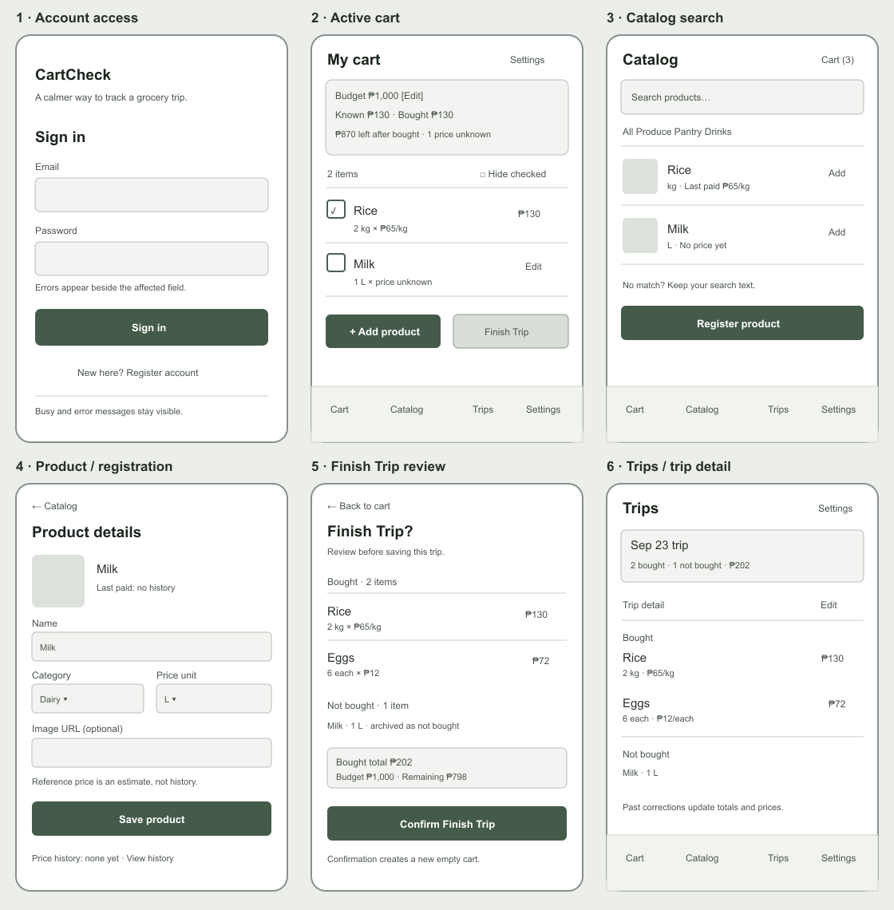
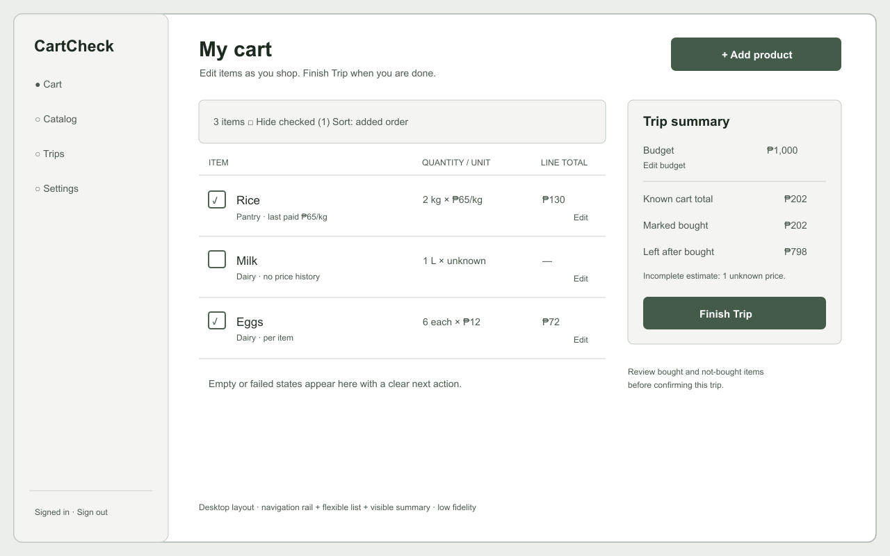
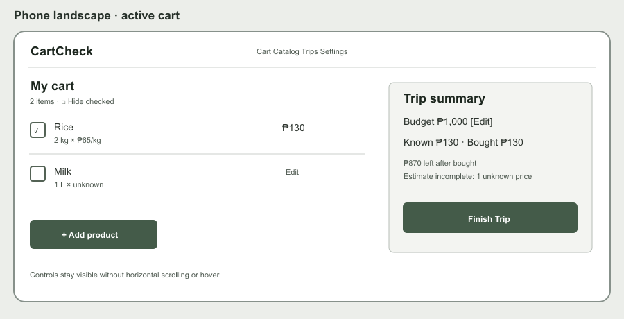
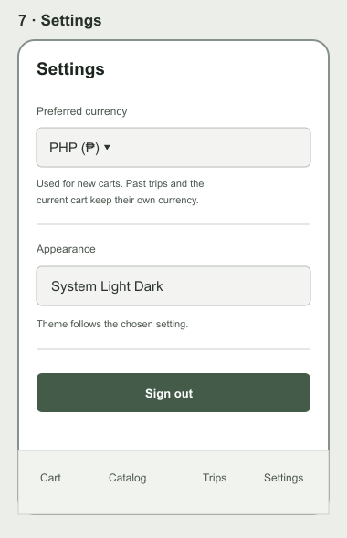
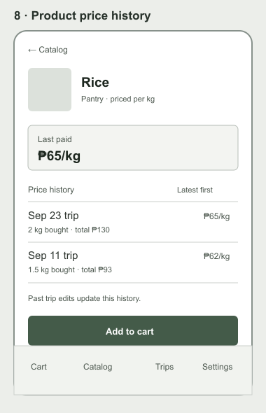

# Visual wireframes

These are actual low-fidelity diagrams showing placement and actions. They use muted neutral placeholders so structure can be reviewed before visual styling. See [the design concept](DESIGN_CONCEPT.md) for the proposed palette and motion.

Editable vector versions: [mobile](wireframes-mobile.svg), [desktop](wireframe-desktop.svg), [landscape](wireframe-landscape.svg), [settings](wireframe-settings.svg), [product history](wireframe-product-history.svg).

## Screen notes and states

| Screen | Primary action | Important states |
| --- | --- | --- |
| Sign in / register | Enter account or switch to registration | Field error, submit busy, authentication error |
| Cart | Edit budget, add product, mark bought, hide checked, Finish Trip | Empty, loading, incomplete estimate, over budget, save error |
| Catalog | Search/filter, add known item, register missing item | No results, image unavailable, no known price |
| Product form | Register or edit name, category, unit, image URL, and reference price | Invalid URL, loading, save error |
| Product detail / price history | Add to cart, inspect dated prices from bought items | No price history, loading, image unavailable |
| Finish Trip review | Confirm or return to cart | No checked items, missing bought price, over-budget warning, duplicate submission protection |
| Trips / trip detail | Open and correct a past trip | No trips, loading, correction error, bought and not-bought groups |
| Settings | Choose preferred currency and theme; sign out | Saved preference, save error, current-trip currency unchanged |

The desktop diagram shows the cart's navigation rail, list, and summary arrangement. Catalog, product, and history screens reuse the same desktop shell and content width. At phone landscape widths, the same information can become a two-column content/summary layout; do not hide essential actions or rely on hover.
