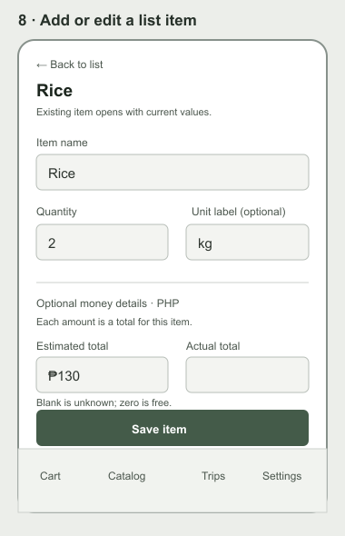

# Visual wireframes

These low-fidelity diagrams show the approved checklist-first placement and actions. Prices and budget are optional secondary controls. They use muted neutral placeholders so structure can be reviewed before visual styling. The original `03-design-system.pdf` and the [shopping-list prototype](prototype/README.md) govern the final colors, white-card treatment, and dark top header; the desktop diagram's side rail is an older layout example.

Editable vector versions: [mobile](wireframes-mobile.svg), [desktop](wireframe-desktop.svg), [landscape](wireframe-landscape.svg), [settings](wireframe-settings.svg), [item editor](wireframe-item-editor.svg).

## Screen notes and states

| Screen | Primary action | Important states |
| --- | --- | --- |
| Sign in / register | Enter account or switch to registration | Field error, submit busy, authentication error |
| Cart | Add/edit items, mark bought, hide checked, optionally edit budget, Finish Trip | Empty, loading, incomplete optional totals, over budget, save error |
| Catalog | Search/filter, add known item, register missing item | No results, image unavailable; no price required |
| Item registration | Register/edit catalog name, category, optional image URL | Invalid URL, loading, save error; no brand, variant or price required |
| Item editor | Edit list name, quantity, optional unit label, separate estimated/actual item totals | Blank amount distinct from zero; returning to an existing row prefills it |
| Finish Trip review | Confirm or return to cart | No checked items, missing bought prices allowed and labeled, over-budget warning, duplicate submission protection |
| Trips / trip detail | Open and correct a past trip | No trips, incomplete spending, loading, correction error, bought and not-bought groups |
| Settings | Choose PHP/USD/EUR and theme; sign out | Saved preference, save error, current-trip currency unchanged |

The desktop diagram shows the primary checklist and optional summary with an older navigation rail. The high-fidelity prototype uses the approved dark top header. Catalog, item editor, and history screens reuse the same content width. At phone landscape widths, the content/summary may use two columns; do not hide essential actions or rely on hover. The former per-product price-history wireframe has been replaced by the quick item editor because that separate screen is outside the approved first release.
