# Multiple named lists — screenshot review

2026-10-05. Actual local application/API/PostgreSQL fixtures. All requested states are included; no production data.

Desktop/mobile overview, both themes at 390, 768, 1440, 1920 and 2560px, creation, budget/no-budget, selected-list view, Catalog destination, completed names and empty state.

## my lists 390 light

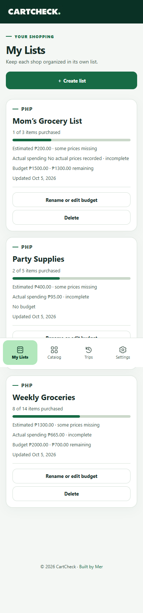

## my lists 768 light

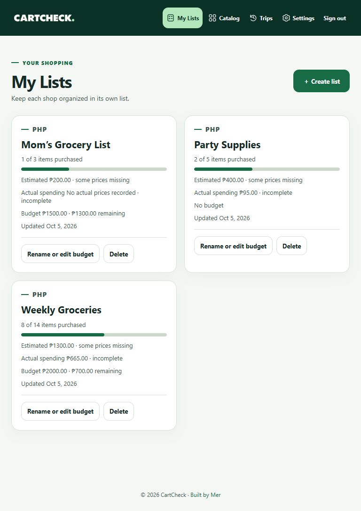

## my lists 1440 light

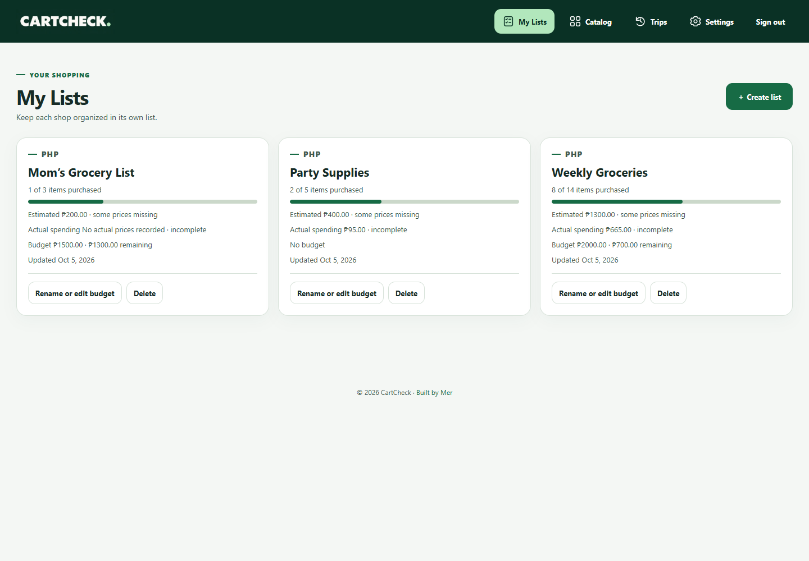

## my lists 1920 light

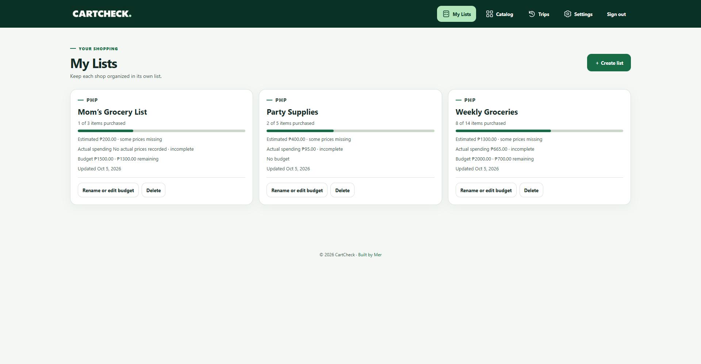

## my lists 2560 light

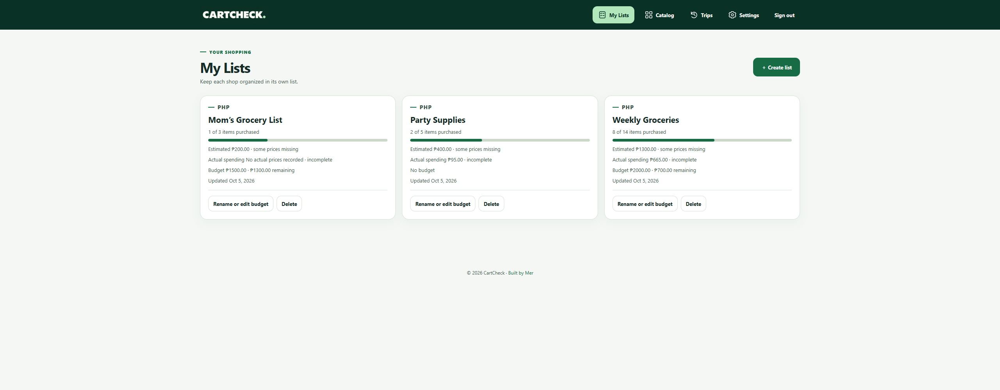

## my lists 390 dark

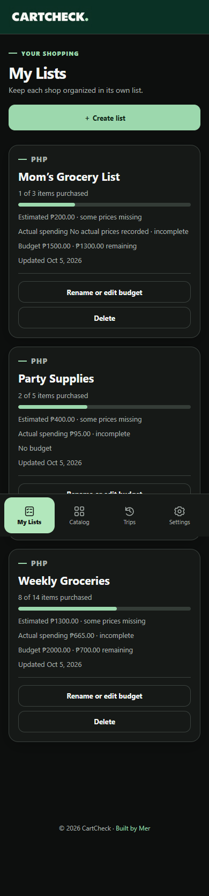

## my lists 768 dark

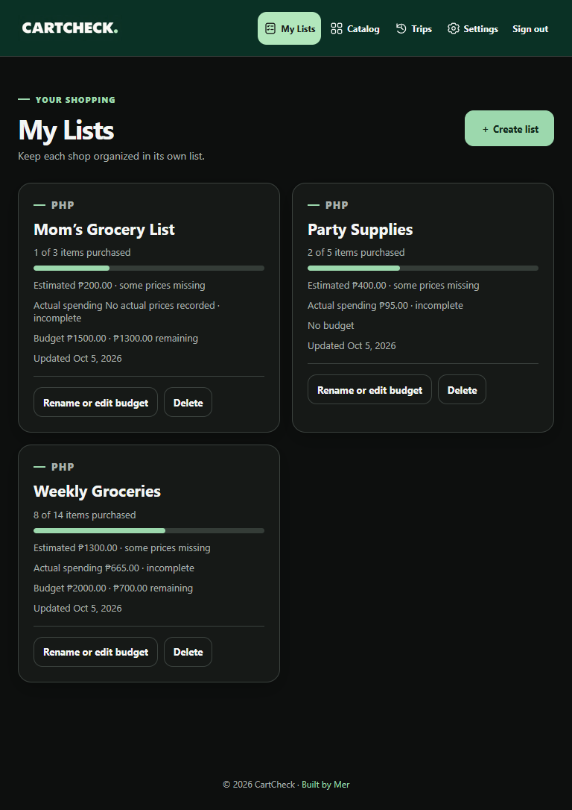

## my lists 1440 dark

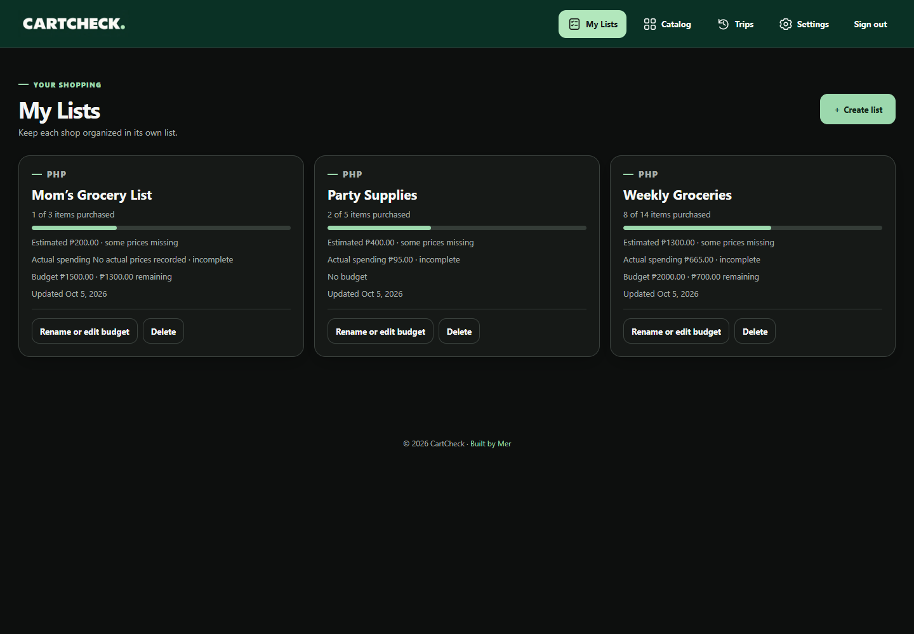

## my lists 1920 dark

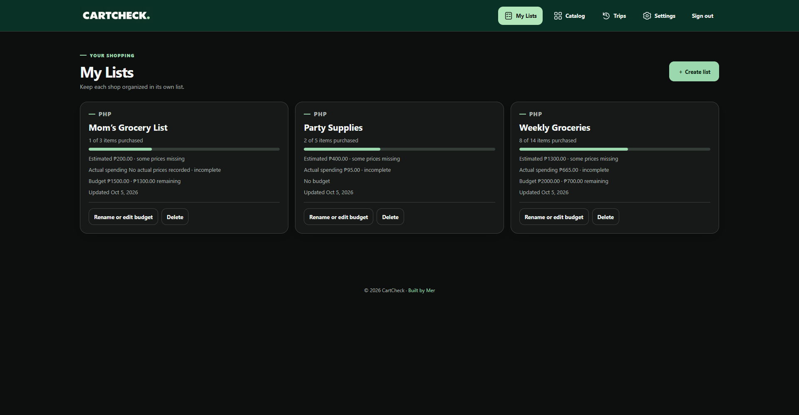

## my lists 2560 dark

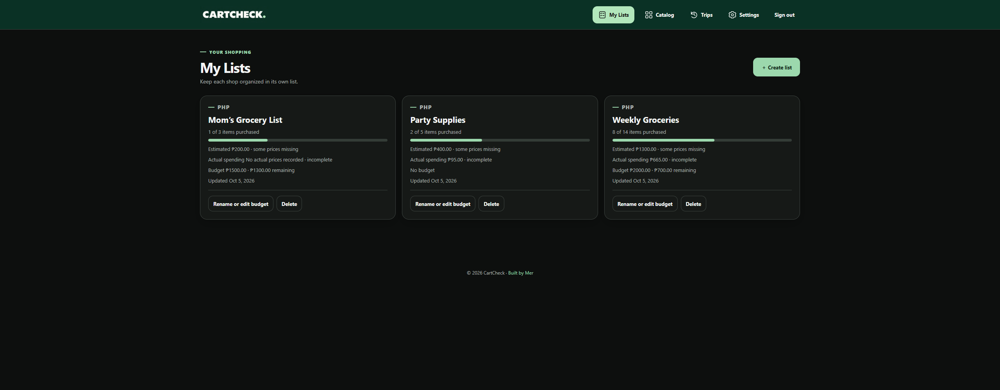

## create list desktop

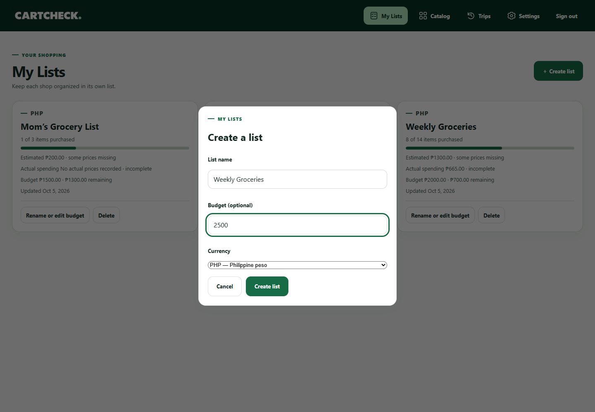

## named list with budget desktop

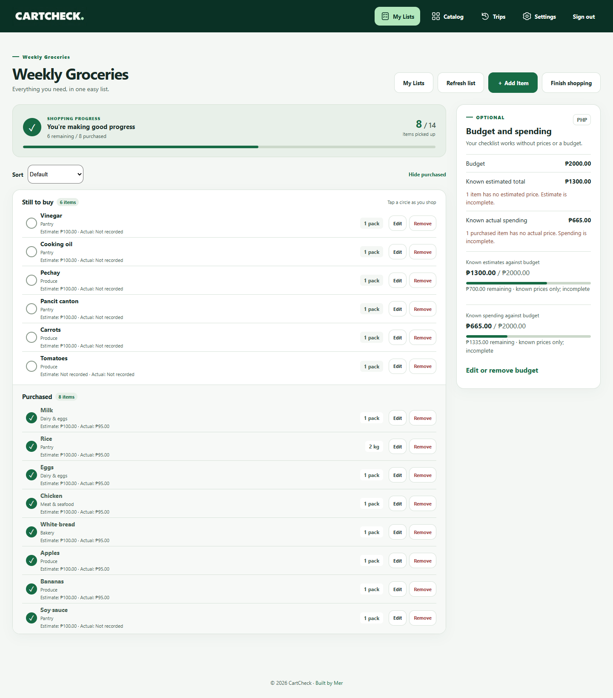

## open shopping list mobile

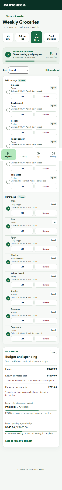

## named list without budget desktop

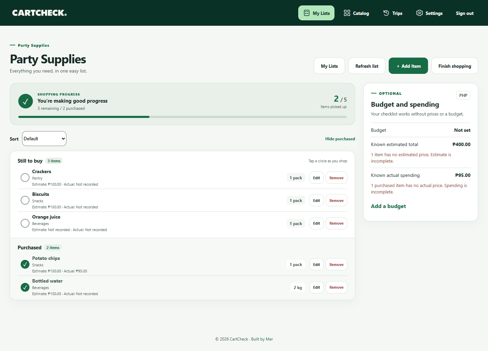

## catalog destination selector

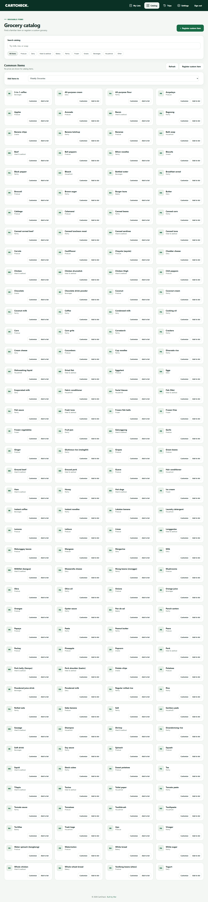

## trips completed list names

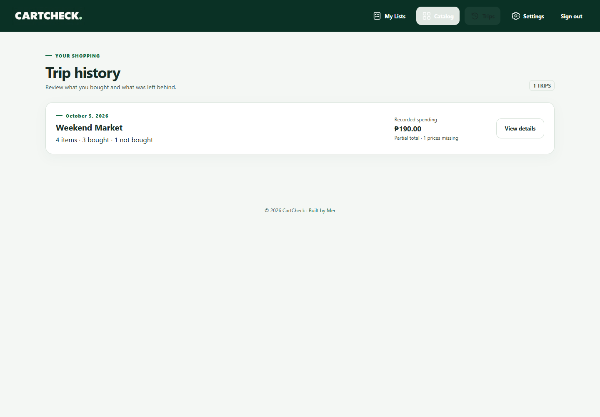

## empty my lists mobile

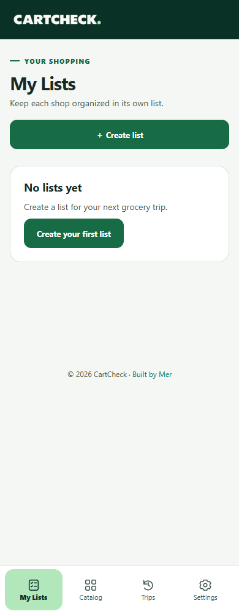
